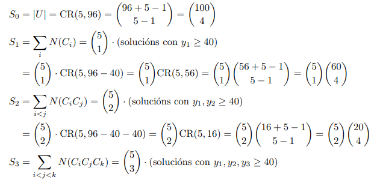

# Boletín Repaso Discreta

## Exercicio 1
{}
### Inxectividade e Sobrexectividade de Aplicacións con Polinomios

#### **Enunciado**

1. Sexa $A = \{a + bx + cx^2 \text{ con } a, b, c \in \mathbb{Z}\}$ o conxunto de polinomios de grao como moito dous e coeficientes enteiros. Consideramos a aplicación $f : A \to A, f(a + bx + cx^2) = b + cx + ax^2$.
Do mesmo xeito, sexa $g : A \to \mathbb{Z}, g(a + bx + cx^2) = a^2 + b^2 + c^2$. (Nota: Asúmese que a definición de $g$ é $g(a+bx+cx^2)$ e non $f(a+bx+cx^2)$ como está escrito literalmente no enunciado).

(a) É $f$ inxectiva? É $f$ sobrexectiva?
(b) É $g$ inxectiva? É $g$ sobrexectiva?

#### **Desenvolvemento**

Definicións:
O conxunto de polinomios é $A = \{a + bx + cx^2 \mid a, b, c \in \mathbb{Z}\}$.
A primeira aplicación é $f: A \to A$, definida por $f(a + bx + cx^2) = b + cx + ax^2$.
A segunda aplicación é $g: A \to \mathbb{Z}$, definida por $g(a + bx + cx^2) = a^2 + b^2 + c^2$.

**a) Análise da aplicación $f(a + bx + cx^2) = b + cx + ax^2$**

**Inxectividade de $f$**
Para determinar se $f$ é inxectiva, debemos verificar se $f(P_1(x)) = f(P_2(x)) \implies P_1(x) = P_2(x)$ para calquera $P_1(x), P_2(x) \in A$.
Sexan $P_1(x) = a_1 + b_1x + c_1x^2 \in A$ e $P_2(x) = a_2 + b_2x + c_2x^2 \in A$.
$f(P_1(x)) = f(P_2(x)) \implies f(a_1 + b_1x + c_1x^2) = f(a_2 + b_2x + c_2x^2)$
$\phantom{f(P_1(x)) = f(P_2(x))} \implies b_1 + c_1x + a_1x^2 = b_2 + c_2x + a_2x^2$
$\phantom{f(P_1(x)) = f(P_2(x))} \implies \left\{ \begin{aligned} b_1 &= b_2 & (\text{coeficientes de } x^0) \\ c_1 &= c_2 & (\text{coeficientes de } x^1) \\ a_1 &= a_2 & (\text{coeficientes de } x^2) \end{aligned} \right.$ (pola igualdade de polinomios)
$\phantom{f(P_1(x)) = f(P_2(x))} \implies a_1 + b_1x + c_1x^2 = a_2 + b_2x + c_2x^2$
$\phantom{f(P_1(x)) = f(P_2(x))} \implies P_1(x) = P_2(x)$
Dado que $f(P_1(x)) = f(P_2(x))$ implica $P_1(x) = P_2(x)$, a función $f$ é inxectiva.

Aquí tes o texto reformulado cun formato máis claro e ben estruturado:

---

Para determinar se $f$ é inxectiva, debemos verificar se

$$
f(P_1(x)) = f(P_2(x)) \implies P_1(x) = P_2(x), \quad \text{para calquera } P_1(x), P_2(x) \in A.
$$

Sexan

$$
P_1(x) = a_1 + b_1x + c_1x^2 \in A, \quad P_2(x) = a_2 + b_2x + c_2x^2 \in A.
$$

Entón,

$$
f(P_1(x)) = f(P_2(x)) \implies f(a_1 + b_1x + c_1x^2) = f(a_2 + b_2x + c_2x^2).
$$

Aplicando a definición de $f$:

$$
\implies b_1 + c_1x + a_1x^2 = b_2 + c_2x + a_2x^2.
$$

Comparando os coeficientes de ambos lados:

$$
\begin{cases}
b_1 = b_2 & \text{(coeficientes de } x^0) \\
c_1 = c_2 & \text{(coeficientes de } x^1) \\
a_1 = a_2 & \text{(coeficientes de } x^2)
\end{cases}
$$

Polo tanto,

$$
a_1 + b_1x + c_1x^2 = a_2 + b_2x + c_2x^2 \implies P_1(x) = P_2(x).
$$

Dado que $f(P_1(x)) = f(P_2(x))$ implica $P_1(x) = P_2(x)$, concluímos que a función $f$ é **inxectiva**.

**Sobrexectividade de $f$**
Para determinar se $f$ é sobrexectiva, debemos verificar se para todo $Q(x) \in A$ (codominio), existe un $P(x) \in A$ (dominio) tal que $f(P(x)) = Q(x)$.
Sexa $Q(x) = \alpha + \beta x + \gamma x^2 \in A$, onde $\alpha, \beta, \gamma \in \mathbb{Z}$.
Buscamos un polinomio $P(x) = a + bx + cx^2 \in A$ (é dicir, $a,b,c \in \mathbb{Z}$) tal que $f(P(x)) = Q(x)$.
$f(a + bx + cx^2) = Q(x) \implies b + cx + ax^2 = \alpha + \beta x + \gamma x^2$
$\phantom{f(a + bx + cx^2) = Q(x)} \implies \left\{ \begin{aligned} b &= \alpha & (\text{coeficientes de } x^0) \\ c &= \beta & (\text{coeficientes de } x^1) \\ a &= \gamma & (\text{coeficientes de } x^2) \end{aligned} \right.$ (pola igualdade de polinomios)
Podemos escoller $a = \gamma$, $b = \alpha$, e $c = \beta$.
Dado que $Q(x) \in A$, os seus coeficientes $\alpha, \beta, \gamma$ son enteiros. Polo tanto, $a, b, c$ son enteiros.
Así, o polinomio $P(x) = \gamma + \alpha x + \beta x^2$ pertence a $A$.
Verificamos: $f(P(x)) = f(\gamma + \alpha x + \beta x^2) = \alpha + \beta x + \gamma x^2 = Q(x)$.
Como para calquera $Q(x) \in A$ existe un $P(x) \in A$ tal que $f(P(x)) = Q(x)$, a función $f$ é sobrexectiva.

**b) Análise da aplicación $g(a + bx + cx^2) = a^2 + b^2 + c^2$**

**Inxectividade de $g$**
Para determinar se $g$ é inxectiva, debemos verificar se $g(P_1(x)) = g(P_2(x)) \implies P_1(x) = P_2(x)$ para calquera $P_1(x), P_2(x) \in A$.
Consideremos un contraexemplo.
Sexa $P_1(x) = 1 + 0x + 0x^2 = 1$. Os coeficientes son $a_1=1, b_1=0, c_1=0$.
$g(P_1(x)) = g(1) = 1^2 + 0^2 + 0^2 = 1$.
Sexa $P_2(x) = -1 + 0x + 0x^2 = -1$. Os coeficientes son $a_2=-1, b_2=0, c_2=0$.
$g(P_2(x)) = g(-1) = (-1)^2 + 0^2 + 0^2 = 1$.
Temos $P_1(x) = 1 \in A$ e $P_2(x) = -1 \in A$.
$g(P_1(x)) = 1$ e $g(P_2(x)) = 1$.
Entón, $g(P_1(x)) = g(P_2(x))$, pero $P_1(x) = 1 \neq -1 = P_2(x)$.
Polo tanto, a función $g$ non é inxectiva.

Outro contraexemplo:
Sexa $P_3(x) = 1 + 2x + 3x^2$. $g(P_3(x)) = 1^2 + 2^2 + 3^2 = 1 + 4 + 9 = 14$.
Sexa $P_4(x) = 3 + 2x + 1x^2$. $g(P_4(x)) = 3^2 + 2^2 + 1^2 = 9 + 4 + 1 = 14$.
$g(P_3(x)) = g(P_4(x))$, pero $P_3(x) \neq P_4(x)$.

**Sobrexectividade de $g$**
Para determinar se $g$ é sobrexectiva, debemos verificar se para todo $k \in \mathbb{Z}$ (codominio), existe un $P(x) \in A$ (dominio) tal que $g(P(x)) = k$.
A imaxe da función $g$ é $\text{Im}(g) = \{ a^2 + b^2 + c^2 \mid a, b, c \in \mathbb{Z} \}$.
Dado que $a, b, c$ son números enteiros, os seus cadrados $a^2, b^2, c^2$ son números enteiros non negativos.
É dicir, $a^2 \geq 0$, $b^2 \geq 0$, $c^2 \geq 0$.
Polo tanto, a suma $a^2 + b^2 + c^2 \geq 0$.
Isto significa que $g(P(x))$ só pode tomar valores enteiros non negativos.
O codominio de $g$ é $\mathbb{Z}$, que inclúe todos os números enteiros (positivos, negativos e cero).
Consideremos un enteiro negativo, por exemplo $k = -1 \in \mathbb{Z}$.
Se $g$ fose sobrexectiva, debería existir un polinomio $P(x) = a+bx+cx^2 \in A$ tal que $g(P(x)) = -1$.
Isto significaría $a^2 + b^2 + c^2 = -1$.
Non obstante, non existen números enteiros $a, b, c$ tales que a suma dos seus cadrados sexa negativa.
Polo tanto, non todo elemento do codominio $\mathbb{Z}$ ten unha preimaxe en $A$.
Así, a función $g$ non é sobrexectiva.

### Resultado final

a) Para a aplicación $f(a + bx + cx^2) = b + cx + ax^2$:
   - $f$ **é** inxectiva.
   - $f$ **é** sobrexectiva.

b) Para a aplicación $g(a + bx + cx^2) = a^2 + b^2 + c^2$:
   - $g$ **non é** inxectiva.
   - $g$ **non é** sobrexectiva.

### Exercicio resolto: Intersección de Conxuntos de Polinomios e Composición de Aplicacións

#### **Enunciado (continuación)**

Coas definicións de $A$, $f$ e $g$ da pregunta anterior:
$A = \{a + bx + cx^2 \mid a, b, c \in \mathbb{Z}\}$
$f : A \to A, f(a + bx + cx^2) = b + cx + ax^2$
$g : A \to \mathbb{Z}, g(a + bx + cx^2) = a^2 + b^2 + c^2$

Sexan os conxuntos:
$X = \{a + ax + ax^2 \text{ con } a \in \mathbb{Z}\}$
$Y = \{a + bx + cx^2 \text{ con } a, b, c \in \mathbb{Z} \text{ e } b + 2c = 6\}$

(c) Achar $X \cap Y$.
(d) Achar o conxunto $Z = \{(g \circ f)(t) \text{ con } t \in X \cap Y \}$.

#### **Desenvolvemento**

**c) Cálculo de $X \cap Y$**

Definimos os conxuntos usando unha notación máis específica para os coeficientes para evitar ambigüidade:
$X = \{k + kx + kx^2 \mid k \in \mathbb{Z}\}$
$Y = \{\alpha_0 + \alpha_1 x + \alpha_2 x^2 \mid \alpha_0, \alpha_1, \alpha_2 \in \mathbb{Z} \text{ e } \alpha_1 + 2\alpha_2 = 6\}$

Sexa $P(x) = p_0 + p_1 x + p_2 x^2$ un polinomio en $X \cap Y$.
Para que $P(x) \in X$:
$\phantom{P(x) \in X} p_0 = p_1 = p_2 = k$, para algún $k \in \mathbb{Z}$.
Para que $P(x) \in Y$:
$\phantom{P(x) \in Y} p_0, p_1, p_2 \in \mathbb{Z}$ e a condición $p_1 + 2p_2 = 6$ debe cumprirse.

Se $P(x) \in X \cap Y$, os seus coeficientes deben satisfacer ambas condicións. Substituímos $p_1=k$ e $p_2=k$ na condición de $Y$:
$k + 2k = 6 \implies 3k = 6 \implies k = 2$.
Os coeficientes de $P(x)$ son entón $p_0=k=2$, $p_1=k=2$, $p_2=k=2$.
Así, o único polinomio que pertence a $X \cap Y$ é $2 + 2x + 2x^2$.
$X \cap Y = \{2 + 2x + 2x^2\}$.

**d) Cálculo de $Z = \{(g \circ f)(t) \mid t \in X \cap Y \}$**

Do apartado (c), sabemos que $X \cap Y$ contén un único elemento. Sexa este $t_0 = 2 + 2x + 2x^2$.
O conxunto $Z$ estará formado polas imaxes de $(g \circ f)$ aplicadas aos elementos de $X \cap Y$. Neste caso, só a $(g \circ f)(t_0)$.
Calculamos $(g \circ f)(t_0)$:
$(g \circ f)(t_0) = g(f(t_0))$.
$\phantom{(g \circ f)(t_0)}$ Os coeficientes de $t_0 = 2 + 2x + 2x^2$ son $a_t=2, b_t=2, c_t=2$.
$\phantom{(g \circ f)(t_0)}$ Aplicando $f(a+bx+cx^2) = b+cx+ax^2$:
$\phantom{(g \circ f)(t_0)} f(t_0) = f(2+2x+2x^2) = 2+2x+2x^2$.
$\phantom{(g \circ f)(t_0)}$ Sexa $P'(x) = f(t_0) = 2+2x+2x^2$. Os coeficientes de $P'(x)$ son $a_{P'}=2, b_{P'}=2, c_{P'}=2$.
$\phantom{(g \circ f)(t_0)}$ Aplicando $g(a+bx+cx^2) = a^2+b^2+c^2$:
$\phantom{(g \circ f)(t_0)} g(P'(x)) = g(2+2x+2x^2) = (2)^2 + (2)^2 + (2)^2 = 4+4+4=12$.
Polo tanto, $(g \circ f)(t_0) = 12$.
O conxunto $Z$ é $Z = \{12\}$.

### Resultado final

c) $X \cap Y = \{2+2x+2x^2\}$
d) $Z = \{12\}$
{}

{}
Aquí está el texto arreglado con el formato adecuado, usando doble espacio al final de cada línea para mantener los saltos de línea y que los phantom funcionen correctamente:

### Inxectividade e Sobrexectividade de Aplicacións con Polinomios

#### **Enunciado**

1. Sexa $A = \{a + bx + cx^2 \text{ con } a, b, c \in \mathbb{Z}\}$ o conxunto de polinomios de grao como moito dous e coeficientes enteiros. Consideramos a aplicación $f : A \to A, f(a + bx + cx^2) = b + cx + ax^2$.  
Do mesmo xeito, sexa $g : A \to \mathbb{Z}, g(a + bx + cx^2) = a^2 + b^2 + c^2$. (Nota: Asúmese que a definición de $g$ é $g(a+bx+cx^2)$ e non $f(a+bx+cx^2)$ como está escrito literalmente no enunciado).

(a) É $f$ inxectiva? É $f$ sobrexectiva?  
(b) É $g$ inxectiva? É $g$ sobrexectiva?

#### **Desenvolvemento**

Definicións:  
O conxunto de polinomios é $A = \{a + bx + cx^2 \mid a, b, c \in \mathbb{Z}\}$.  
A primeira aplicación é $f: A \to A$, definida por $f(a + bx + cx^2) = b + cx + ax^2$.  
A segunda aplicación é $g: A \to \mathbb{Z}$, definida por $g(a + bx + cx^2) = a^2 + b^2 + c^2$.  

**a) Análise da aplicación $f(a + bx + cx^2) = b + cx + ax^2$**

**Inxectividade de $f$**  
Para determinar se $f$ é inxectiva, debemos verificar se $f(P_1(x)) = f(P_2(x)) \implies P_1(x) = P_2(x)$ para calquera $P_1(x), P_2(x) \in A$.  
Sexan $P_1(x) = a_1 + b_1x + c_1x^2 \in A$ e $P_2(x) = a_2 + b_2x + c_2x^2 \in A$.  
$f(P_1(x)) = f(P_2(x)) \implies f(a_1 + b_1x + c_1x^2) = f(a_2 + b_2x + c_2x^2)$  
$\phantom{f(P_1(x)) = f(P_2(x))} \implies b_1 + c_1x + a_1x^2 = b_2 + c_2x + a_2x^2$  
$\phantom{f(P_1(x)) = f(P_2(x))} \implies \left\{ \begin{aligned} b_1 &= b_2 & (\text{coeficientes de } x^0) \\ c_1 &= c_2 & (\text{coeficientes de } x^1) \\ a_1 &= a_2 & (\text{coeficientes de } x^2) \end{aligned} \right.$ (pola igualdade de polinomios)  
$\phantom{f(P_1(x)) = f(P_2(x))} \implies a_1 + b_1x + c_1x^2 = a_2 + b_2x + c_2x^2$  
$\phantom{f(P_1(x)) = f(P_2(x))} \implies P_1(x) = P_2(x)$  
Dado que $f(P_1(x)) = f(P_2(x))$ implica $P_1(x) = P_2(x)$, a función $f$ é inxectiva.

**Sobrexectividade de $f$**  
Para determinar se $f$ é sobrexectiva, debemos verificar se para todo $Q(x) \in A$ (codominio), existe un $P(x) \in A$ (dominio) tal que $f(P(x)) = Q(x)$.  
Sexa $Q(x) = \alpha + \beta x + \gamma x^2 \in A$, onde $\alpha, \beta, \gamma \in \mathbb{Z}$.  
Buscamos un polinomio $P(x) = a + bx + cx^2 \in A$ (é dicir, $a,b,c \in \mathbb{Z}$) tal que $f(P(x)) = Q(x)$.  
$f(a + bx + cx^2) = Q(x) \implies b + cx + ax^2 = \alpha + \beta x + \gamma x^2$  
$\phantom{f(a + bx + cx^2) = Q(x)} \implies \left\{ \begin{aligned} b &= \alpha & (\text{coeficientes de } x^0) \\ c &= \beta & (\text{coeficientes de } x^1) \\ a &= \gamma & (\text{coeficientes de } x^2) \end{aligned} \right.$ (pola igualdade de polinomios)  
Podemos escoller $a = \gamma$, $b = \alpha$, e $c = \beta$.  
Dado que $Q(x) \in A$, os seus coeficientes $\alpha, \beta, \gamma$ son enteiros. Polo tanto, $a, b, c$ son enteiros.  
Así, o polinomio $P(x) = \gamma + \alpha x + \beta x^2$ pertence a $A$.  
Verificamos: $f(P(x)) = f(\gamma + \alpha x + \beta x^2) = \alpha + \beta x + \gamma x^2 = Q(x)$.  
Como para calquera $Q(x) \in A$ existe un $P(x) \in A$ tal que $f(P(x)) = Q(x)$, a función $f$ é sobrexectiva.

**b) Análise da aplicación $g(a + bx + cx^2) = a^2 + b^2 + c^2$**

**Inxectividade de $g$**  
Para determinar se $g$ é inxectiva, debemos verificar se $g(P_1(x)) = g(P_2(x)) \implies P_1(x) = P_2(x)$ para calquera $P_1(x), P_2(x) \in A$.  
Consideremos un contraexemplo.  
Sexa $P_1(x) = 1 + 0x + 0x^2 = 1$. Os coeficientes son $a_1=1, b_1=0, c_1=0$.  
$g(P_1(x)) = g(1) = 1^2 + 0^2 + 0^2 = 1$.  
Sexa $P_2(x) = -1 + 0x + 0x^2 = -1$. Os coeficientes son $a_2=-1, b_2=0, c_2=0$.  
$g(P_2(x)) = g(-1) = (-1)^2 + 0^2 + 0^2 = 1$.  
Temos $P_1(x) = 1 \in A$ e $P_2(x) = -1 \in A$.  
$g(P_1(x)) = 1$ e $g(P_2(x)) = 1$.
**Inxectividade de $g$** (continuación)  
Entón, $g(P_1(x)) = g(P_2(x))$, pero $P_1(x) = 1 \neq -1 = P_2(x)$.  
Polo tanto, a función $g$ non é inxectiva.

Outro contraexemplo:  
Sexa $P_3(x) = 1 + 2x + 3x^2$. $g(P_3(x)) = 1^2 + 2^2 + 3^2 = 1 + 4 + 9 = 14$.  
Sexa $P_4(x) = 3 + 2x + 1x^2$. $g(P_4(x)) = 3^2 + 2^2 + 1^2 = 9 + 4 + 1 = 14$.  
$g(P_3(x)) = g(P_4(x))$, pero $P_3(x) \neq P_4(x)$.

**Sobrexectividade de $g$**  
Para determinar se $g$ é sobrexectiva, debemos verificar se para todo $k \in \mathbb{Z}$ (codominio), existe un $P(x) \in A$ (dominio) tal que $g(P(x)) = k$.  
A imaxe da función $g$ é $\text{Im}(g) = \{ a^2 + b^2 + c^2 \mid a, b, c \in \mathbb{Z} \}$.  
Dado que $a, b, c$ son números enteiros, os seus cadrados $a^2, b^2, c^2$ son números enteiros non negativos.  
É dicir, $a^2 \geq 0$, $b^2 \geq 0$, $c^2 \geq 0$.  
Polo tanto, a suma $a^2 + b^2 + c^2 \geq 0$.  
Isto significa que $g(P(x))$ só pode tomar valores enteiros non negativos.  
O codominio de $g$ é $\mathbb{Z}$, que inclúe todos os números enteiros (positivos, negativos e cero).  
Consideremos un enteiro negativo, por exemplo $k = -1 \in \mathbb{Z}$.  
Se $g$ fose sobrexectiva, debería existir un polinomio $P(x) = a+bx+cx^2 \in A$ tal que $g(P(x)) = -1$.  
Isto significaría $a^2 + b^2 + c^2 = -1$.  
Non obstante, non existen números enteiros $a, b, c$ tales que a suma dos seus cadrados sexa negativa.  
Polo tanto, non todo elemento do codominio $\mathbb{Z}$ ten unha preimaxe en $A$.  
Así, a función $g$ non é sobrexectiva.

### Resultado final

a) Para a aplicación $f(a + bx + cx^2) = b + cx + ax^2$:  
   - $f$ **é** inxectiva.  
   - $f$ **é** sobrexectiva.

b) Para a aplicación $g(a + bx + cx^2) = a^2 + b^2 + c^2$:  
   - $g$ **non é** inxectiva.  
   - $g$ **non é** sobrexectiva.

### Exercicio resolto: Intersección de Conxuntos de Polinomios e Composición de Aplicacións

#### **Enunciado (continuación)**

Coas definicións de $A$, $f$ e $g$ da pregunta anterior:  
$A = \{a + bx + cx^2 \mid a, b, c \in \mathbb{Z}\}$  
$f : A \to A, f(a + bx + cx^2) = b + cx + ax^2$  
$g : A \to \mathbb{Z}, g(a + bx + cx^2) = a^2 + b^2 + c^2$

Sexan os conxuntos:  
$X = \{a + ax + ax^2 \text{ con } a \in \mathbb{Z}\}$  
$Y = \{a + bx + cx^2 \text{ con } a, b, c \in \mathbb{Z} \text{ e } b + 2c = 6\}$

(c) Achar $X \cap Y$.  
(d) Achar o conxunto $Z = \{(g \circ f)(t) \text{ con } t \in X \cap Y \}$.

#### **Desenvolvemento**

**c) Cálculo de $X \cap Y$**

Definimos os conxuntos usando unha notación máis específica para os coeficientes para evitar ambigüidade:  
$X = \{k + kx + kx^2 \mid k \in \mathbb{Z}\}$  
$Y = \{\alpha_0 + \alpha_1 x + \alpha_2 x^2 \mid \alpha_0, \alpha_1, \alpha_2 \in \mathbb{Z} \text{ e } \alpha_1 + 2\alpha_2 = 6\}$

Sexa $P(x) = p_0 + p_1 x + p_2 x^2$ un polinomio en $X \cap Y$.  
Para que $P(x) \in X$:  
$\phantom{P(x) \in X} p_0 = p_1 = p_2 = k$, para algún $k \in \mathbb{Z}$.  
Para que $P(x) \in Y$:  
$\phantom{P(x) \in Y} p_0, p_1, p_2 \in \mathbb{Z}$ e a condición $p_1 + 2p_2 = 6$ debe cumprirse.

Se $P(x) \in X \cap Y$, os seus coeficientes deben satisfacer ambas condicións. Substituímos $p_1=k$ e $p_2=k$ na condición de $Y$:  
$k + 2k = 6 \implies 3k = 6 \implies k = 2$.  
Os coeficientes de $P(x)$ son entón $p_0=k=2$, $p_1=k=2$, $p_2=k=2$.  
Así, o único polinomio que pertence a $X \cap Y$ é $2 + 2x + 2x^2$.  
$X \cap Y = \{2 + 2x + 2x^2\}$.

**d) Cálculo de $Z = \{(g \circ f)(t) \mid t \in X \cap Y \}$**

Do apartado (c), sabemos que $X \cap Y$ contén un único elemento. Sexa este $t_0 = 2 + 2x + 2x^2$.  
O conxunto $Z$ estará formado polas imaxes de $(g \circ f)$ aplicadas aos elementos de $X \cap Y$. Neste caso, só a $(g \circ f)(t_0)$.  
Calculamos $(g \circ f)(t_0)$:  
$(g \circ f)(t_0) = g(f(t_0))$.  
$\phantom{(g \circ f)(t_0)}$ Os coeficientes de $t_0 = 2 + 2x + 2x^2$ son $a_t=2, b_t=2, c_t=2$.  
$\phantom{(g \circ f)(t_0)}$ Aplicando $f(a+bx+cx^2) = b+cx+ax^2$:  
$\phantom{(g \circ f)(t_0)} f(t_0) = f(2+2x+2x^2) = 2+2x+2x^2$.  
$\phantom{(g \circ f)(t_0)}$ Sexa $P'(x) = f(t_0) = 2+2x+2x^2$. Os coeficientes de $P'(x)$ son $a_{P'}=2, b_{P'}=2, c_{P'}=2$.  
$\phantom{(g \circ f)(t_0)}$ Aplicando $g(a+bx+cx^2) = a^2+b^2+c^2$:  
$\phantom{(g \circ f)(t_0)} g(P'(x)) = g(2+2x+2x^2) = (2)^2 + (2)^2 + (2)^2 = 4+4+4=12$.  
Polo tanto, $(g \circ f)(t_0) = 12$.  
O conxunto $Z$ é $Z = \{12\}$.

### Resultado final

c) $X \cap Y = \{2+2x+2x^2\}$  
d) $Z = \{12\}$
{}

## Exercicio 2 

{}

### Bixectividade da Aplicación Inducida no Conxunto das Partes

#### **Enunciado**

Sexan $A$ e $B$ dous conxuntos e $f : A \to B$ unha aplicación. Demostrar que a aplicación inducida $f_* : \mathcal{P}(A) \to \mathcal{P}(B)$ é bixectiva se, e soamente se, $f$ tamén é bixectiva.

#### **Desenvolvemento**

**Definicións**

*   Sexa $f: A \to B$ unha aplicación entre dous conxuntos $A$ e $B$.
*   $\mathcal{P}(A)$ e $\mathcal{P}(B)$ son os conxuntos das partes de $A$ e $B$, respectivamente.
*   A aplicación inducida (ou imaxe directa) $f_\*: \mathcal{P}(A) \to \mathcal{P}(B)$ defínese para calquera $X \in \mathcal{P}(A)$ como:
    $f_*(X) = \{f(x) \mid x \in X\}$.
*   Unha aplicación é **bixectiva** se é á vez **inxectiva** e **sobrexectiva**.
    *   $g$ é **inxectiva**: $g(x_1) = g(x_2) \implies x_1 = x_2$.
    *   $g$ é **sobrexectiva**: Para todo $y$ no codominio, existe un $x$ no dominio tal que $g(x) = y$.

A demostración require probar a dobre implicación ($\iff$).

---

**($\implies$) Proba de que se $f_*$ é bixectiva, entón $f$ é bixectiva.**

Asumimos que $f_*: \mathcal{P}(A) \to \mathcal{P}(B)$ é bixectiva. Debemos probar que $f: A \to B$ é inxectiva e sobrexectiva.

1. **Proba de que $f$ é inxectiva:**

$$
\begin{aligned}
& \text{Sexan } a_1, a_2 \in A \text{ tal que } f(a_1) = f(a_2). \\
& \text{Consideremos os conxuntos unitarios } X_1 = \{a_1\} \text{ e } X_2 = \{a_2\}, \text{ ambos en } \mathcal{P}(A). \\
& f_*(X_1) = f_*(\{a_1\}) = \{f(a_1)\}. \\
& f_*(X_2) = f_*(\{a_2\}) = \{f(a_2)\}. \\
& \text{Como } f(a_1) = f(a_2), \text{ temos que } \{f(a_1)\} = \{f(a_2)\}, \text{ polo tanto } f_*(X_1) = f_*(X_2). \\
& \text{Por hipótese, } f_* \text{ é inxectiva, o que implica que } f_*(X_1) = f_*(X_2) \implies X_1 = X_2. \\
& \text{Entón, } \{a_1\} = \{a_2\}, \text{ o que significa que } a_1 = a_2. \\
& \therefore f \text{ é inxectiva.}
\end{aligned}
$$

2.  **Proba de que $f$ é sobrexectiva:**
$$
\begin{aligned}
& \text{Sexa } b \in B \text{ un elemento arbitrario.} \\
& \text{Consideremos o conxunto unitario } Y = \{b\}, \text{ que pertence a } \mathcal{P}(B). \\
& \text{Por hipótese, } f_* \text{ é sobrexectiva, polo que para } Y \in \mathcal{P}(B) \text{ existe un } X \in \mathcal{P}(A) \text{ tal que } f_*(X) = Y. \\
& \text{Isto é, } f_*(X) = \{b\}. \\
& \text{Pola definición de } f_*, \text{ isto significa que } \{f(x) \mid x \in X\} = \{b\}. \\
& \text{Esta igualdade implica que o conxunto } X \text{ non pode ser baleiro (se non, } f_*(\emptyset) = \emptyset \neq \{b\}). \\
& \text{Polo tanto, existe polo menos un elemento } a \in X. \\
& \text{Ademais, para calquera } x \in X, \text{ a súa imaxe } f(x) \text{ debe ser } b. \\
& \text{En particular, para o elemento } a \in X, \text{ cúmprese que } f(a) = b. \\
& \text{Así, para un } b \in B \text{ arbitrario, atopamos un } a \in A \text{ tal que } f(a)=b. \\
& \therefore f \text{ é sobrexectiva.}
\end{aligned}
$$

Dado que $f$ é inxectiva e sobrexectiva, $f$ é bixectiva.

---

**($\impliedby$) Proba de que se $f$ é bixectiva, entón $f_*$ é bixectiva.**

Asumimos que $f: A \to B$ é bixectiva. Debemos probar que $f_*: \mathcal{P}(A) \to \mathcal{P}(B)$ é inxectiva e sobrexectiva.

1.  **Proba de que $f_*$ é inxectiva:**

$$
\begin{aligned}
& \text{Sexan } X_1, X_2 \in \mathcal{P}(A) \text{ tal que } f_*(X_1) = f_*(X_2). \\
& \text{Debemos probar que } X_1 = X_2, \text{ o que require demostrar } X_1 \subseteq X_2 \text{ e } X_2 \subseteq X_1. \\
& \text{i) Proba de } X_1 \subseteq X_2: \\
& \quad \text{Sexa } x_1 \in X_1 \text{ un elemento arbitrario. Entón } f(x_1) \in f_*(X_1). \\
& \quad \text{Como } f_*(X_1) = f_*(X_2), \text{ temos que } f(x_1) \in f_*(X_2). \\
& \quad \text{Pola definición de } f_*(X_2), \text{ isto implica que existe un } x_2 \in X_2 \text{ tal que } f(x_1) = f(x_2). \\
& \quad \text{Por hipótese, } f \text{ é inxectiva, polo que } f(x_1) = f(x_2) \implies x_1 = x_2. \\
& \quad \text{Dado que } x_2 \in X_2, \text{ e } x_1 = x_2, \text{ concluímos que } x_1 \in X_2. \\
& \quad \text{Polo tanto, } X_1 \subseteq X_2. \\
& \text{ii) A proba de } X_2 \subseteq X_1 \text{ é análoga, intercambiando os roles de } X_1 \text{ e } X_2. \\
& \text{Concluímos que } X_1 = X_2. \\
& \therefore f_* \text{ é inxectiva.}
\end{aligned}
$$

2.  **Proba de que $f_*$ é sobrexectiva:**

$$
\begin{aligned}
& \text{Sexa } Y \in \mathcal{P}(B) \text{ un subconxunto arbitrario de } B. \\
& \text{Debemos atopar un conxunto } X \in \mathcal{P}(A) \text{ tal que } f_*(X) = Y. \\
& \text{Por hipótese, } f \text{ é sobrexectiva. Polo tanto, para cada } y \in Y, \text{ existe polo menos un } a \in A \text{ tal que } f(a)=y. \\
& \text{Ademais, como } f \text{ é inxectiva, este elemento } a \text{ é único para cada } y. \\
& \text{Definamos o conxunto } X \text{ como o conxunto de todas estas preimaxes únicas para os elementos de } Y. \\
& X = \{a \in A \mid f(a) \in Y\} \text{ (este conxunto é a preimaxe } f^{-1}(Y)). \\
& \text{Agora debemos probar que } f_*(X) = Y. \\
& \text{i) Proba de } f_*(X) \subseteq Y: \\
& \quad \text{Sexa } b \in f_*(X). \text{ Por definición, } b = f(x) \text{ para algún } x \in X. \\
& \quad \text{Como } x \in X, \text{ pola definición de } X \text{ temos que } f(x) \in Y. \\
& \quad \text{Polo tanto, } b \in Y. \text{ Así, } f_*(X) \subseteq Y. \\
& \text{ii) Proba de } Y \subseteq f_*(X): \\
& \quad \text{Sexa } y \in Y \text{ un elemento arbitrario.} \\
& \quad \text{Como } f \text{ é sobrexectiva, existe un } a \in A \text{ tal que } f(a) = y. \\
& \quad \text{Como } f(a) = y \in Y, \text{ por definición de } X, \text{ este elemento } a \text{ pertence a } X. \\
& \quad \text{Agora, aplicamos } f_* \text{ a } X. \text{ Como } a \in X, \text{ a súa imaxe } f(a) \text{ debe estar en } f_*(X). \\
& \quad \text{Dado que } f(a) = y, \text{ concluímos que } y \in f_*(X). \\
& \quad \text{Polo tanto, } Y \subseteq f_*(X). \\
& \text{De i) e ii) concluímos que } f_*(X) = Y. \\
& \therefore f_* \text{ é sobrexectiva.}
\end{aligned}
$$

Dado que $f_\*$ é inxectiva e sobrexectiva, $f_\*$ é polo tanto bixectiva.

### Resultado final

Demostrouse que a aplicación inducida $f_*: \mathcal{P}(A) \to \mathcal{P}(B)$ é bixectiva se, e só se, a aplicación orixinal $f: A \to B$ é bixectiva. A proba realizouse demostrando as dúas implicacións:

1.  **($\implies$)**: Se $f_*$ é bixectiva, entón $f$ é inxectiva e sobrexectiva, polo tanto bixectiva.
2.  **($\impliedby$)**: Se $f$ é bixectiva, entón $f_*$ é inxectiva e sobrexectiva, polo tanto bixectiva.
{}

## Exercicio 3
{}

### **Ejercicio de Teoría de Conjuntos y Funciones**

#### **Definiciones y Hipótesis**

$$
\begin{aligned}
& \text{Sexa } f: A \to B \text{ unha aplicación (función).} \\
& \text{Sexa } A_1 \subseteq A \text{ un subconxunto de } A. \\
& \\
& \text{Definición de inxectividade:} && f(x_1) = f(x_2) \implies x_1 = x_2, \quad \forall x_1, x_2 \in A. \\
& \text{Definición de sobrexectividade:} && \forall y \in B, \exists x \in A \text{ tal que } f(x) = y. \\
& \text{Definición de bixectividade:} && f \text{ é inxectiva e sobrexectiva.} \\
& \\
& \text{Definición de imaxe dun conxunto:} && f(S) = \{f(x) \mid x \in S\}, \text{ para } S \subseteq A. \\
& \text{Definición de diferenza de conxuntos:} && X - Y = \{z \mid z \in X \land z \notin Y\}.
\end{aligned}
$$

---

#### **Resolución**

**a) Demostrar que se $f$ é inxectiva, entón $f(A - A_1) \subseteq B - f(A_1)$.**

$$
\begin{aligned}
& \text{Para demostrar a inclusión, tomamos un elemento arbitrario } y \in f(A - A_1) \text{ e probamos que } y \in B - f(A_1). \\
& \\
& \text{Sexa } y \in f(A - A_1) \\
& \implies \exists x \in A - A_1 \text{ tal que } f(x) = y. \\
& \quad \text{Isto significa que } x \in A \text{ e } x \notin A_1. \\
& \text{Como } f: A \to B, \text{ é inmediato que } y = f(x) \in B. \\
& \\
& \text{Agora, debemos probar que } y \notin f(A_1). \text{ Procedemos por redución ao absurdo.} \\
& \quad \text{Supoñamos que } y \in f(A_1). \\
& \quad \implies \exists x_1 \in A_1 \text{ tal que } f(x_1) = y. \\
& \quad \text{Temos entón que } f(x) = y \text{ e } f(x_1) = y, \text{ polo que } f(x) = f(x_1). \\
& \quad \text{Dado que } f \text{ é inxectiva por hipótese:} \\
& \qquad f(x) = f(x_1) \implies x = x_1. \\
& \quad \text{Isto leva a unha contradición, xa que tiñamos que } x \notin A_1 \text{ e } x_1 \in A_1. \\
& \quad \text{Polo tanto, a nosa suposición inicial era falsa. Concluímos que } y \notin f(A_1). \\
& \\
& \text{Demostramos que se } y \in f(A - A_1)\text{, entón } y \in B \text{ e } y \notin f(A_1). \\
& \implies y \in B - f(A_1). \\
& \text{Como } y \text{ era un elemento arbitrario, queda demostrado que } f(A - A_1) \subseteq B - f(A_1).
\end{aligned}
$$

**b) Demostrar que se $f$ é sobrexectiva, entón $B - f(A_1) \subseteq f(A - A_1)$.**

$$
\begin{aligned}
& \text{Para demostrar a inclusión, tomamos un elemento arbitrario } y \in B - f(A_1) \text{ e probamos que } y \in f(A - A_1). \\
& \\
& \text{Sexa } y \in B - f(A_1). \\
& \implies y \in B \text{ e } y \notin f(A_1). \\
& \\
& \text{Por hipótese, } f \text{ é sobrexectiva.} \\
& \quad \text{Pola definición de sobrexectividade, para o noso } y \in B, \text{ existe polo menos un } x \in A \text{ tal que } f(x) = y. \\
& \\
& \text{Agora, debemos probar que este } x \text{ pertence a } A - A_1. \text{ É dicir, que } x \notin A_1. \\
& \quad \text{Procedemos de novo por redución ao absurdo.} \\
& \quad \text{Supoñamos que } x \in A_1. \\
& \quad \text{Se } x \in A_1, \text{ entón por definición de imaxe, } f(x) \text{ debe pertencer a } f(A_1). \\
& \quad \text{Como } f(x) = y, \text{ isto implicaría que } y \in f(A_1). \\
& \quad \text{Isto contradí a nosa premisa inicial de que } y \notin f(A_1). \\
& \quad \text{Polo tanto, a suposición de que } x \in A_1 \text{ é falsa. Concluímos que } x \notin A_1. \\
& \\
& \text{Xa que } x \in A \text{ e } x \notin A_1, \text{ temos que } x \in A - A_1. \\
& \text{Como atopamos un } x \in A - A_1 \text{ tal que } f(x) = y, \text{ por definición de imaxe, } y \in f(A - A_1). \\
& \text{Como } y \text{ era un elemento arbitrario, queda demostrado que } B - f(A_1) \subseteq f(A - A_1).
\end{aligned}
$$

**c) Concluír que se $f$ é bixectiva, $f(A - A_1) = B - f(A_1)$.**

$$
\begin{aligned}
& \text{Para demostrar a igualdade de conxuntos, debemos probar a dobre inclusión: } \\
& \quad \text{1. } f(A - A_1) \subseteq B - f(A_1) \\
& \quad \text{2. } B - f(A_1) \subseteq f(A - A_1) \\
& \\
& \text{Se } f \text{ é bixectiva, entón é inxectiva e sobrexectiva por definición.} \\
& \\
& \text{Polo apartado (a), como } f \text{ é inxectiva, tense que:} \\
& \quad f(A - A_1) \subseteq B - f(A_1). \\
& \\
& \text{Polo apartado (b), como } f \text{ é sobrexectiva, tense que:} \\
& \quad B - f(A_1) \subseteq f(A - A_1). \\
& \\
& \text{Ao cumprirse ambas as inclusións, conclúese que os conxuntos son iguais.}
\end{aligned}
$$

### Resultado final
$$
\begin{aligned}
& \text{a) Se } f \text{ é inxectiva, queda demostrado que } & f(A - A_1) \subseteq B - f(A_1). \\
& \text{b) Se } f \text{ é sobrexectiva, queda demostrado que } & B - f(A_1) \subseteq f(A - A_1). \\
& \text{c) Como consecuencia directa de (a) e (b), se } f \text{ é bixectiva, conclúese que } & f(A - A_1) = B - f(A_1).
\end{aligned}
$$
{}

{}
Claro que si! É unha pregunta moi importante, porque é o corazón do problema. Imos analizar cada un deses puntos cunha explicación máis intuitiva, paso a paso.

---

### **Explicación 1: Por que a INXECTIVIDADE implica $f(A - A_1) \subseteq B - f(A_1)$**

Isto é o que demostramos no **apartado (a)**.

**O obxectivo:** Queremos demostrar que calquera elemento que estea en $f(A - A_1)$ tamén ten que estar, por narices, en $B - f(A_1)$.

Imos facelo cunha pequena historia lóxica:

1.  **Collemos un elemento:** Imaxina que metes a man no conxunto $f(A - A_1)$ e sacas un elemento calquera. Chamémoslle $y$.

2.  **Que sabemos sobre $y$?**
    Se $y$ está en $f(A - A_1)$, significa que $y$ é a "imaxe" ou o "resultado" de aplicar a función $f$ a algún elemento do conxunto $A - A_1$.
    Chamemos a ese elemento de orixe $x$.
    Entón, sabemos dúas cousas sobre $x$:
    *   $f(x) = y$.
    *   $x$ está en $A$ pero **NON** está en $A_1$ (isto é o que significa $x \in A - A_1$).

3.  **A onde queremos chegar?**
    Queremos demostrar que o noso $y$ ten que vivir no conxunto $B - f(A_1)$. Para iso, $y$ ten que cumprir dúas condicións:
    *   Condición 1: $y$ debe estar en $B$. (Isto é fácil, porque $f$ é unha función de $A$ a $B$, así que todos os seus resultados están en $B$).
    *   Condición 2: $y$ **NON** debe estar en $f(A_1)$. (Esta é a parte crucial).

4.  **Por que $y$ non pode estar en $f(A_1)$? Aquí entra a INXECTIVIDADE.**
    Pensemos por un momento que pasaría se $y$ **si** estivese en $f(A_1)$.
    *   Se $y$ estivese en $f(A_1)$, significaría que existiría algún elemento dentro de $A_1$ (chamémoslle $x_1$) tal que $f(x_1) = y$.
    *   Pero agarda un momento... Tiñamos que $f(x) = y$ e agora teriamos que $f(x_1) = y$.
    *   Isto significa que $f(x) = f(x_1)$.

    Aquí é onde usamos a nosa "arma secreta": a **inxectividade**. A inxectividade é como unha lei que di: "un resultado, unha única orixe". Se dous resultados son iguais, as súas orixes teñen que ser a mesma.
    *   Como $f$ é inxectiva, de $f(x) = f(x_1)$ deducimos que $x = x_1$.

    E aquí chegamos a unha **contradicción lóxica!**
    *   Sabiamos dende o principio que o noso $x$ **NON** estaba en $A_1$.
    *   Pero se $x = x_1$, e $x_1$ **SI** está en $A_1$, entón $x$ tería que estar e non estar en $A_1$ ao mesmo tempo. Iso é imposible!

    **Conclusión:** A nosa suposición de que "$y$ está en $f(A_1)$" lévanos a unha contradición. Polo tanto, esa suposición ten que ser falsa. A única posibilidade é que $y$ **NON** estea en $f(A_1)$.

Como demostramos que $y$ está en $B$ e que $y$ non está en $f(A_1)$, entón $y$ pertence a $B - f(A_1)$. E isto proba o que queriamos.

---

### **Explicación 2: Por que a SOBREXECTIVIDADE implica $B - f(A_1) \subseteq f(A - A_1)$**

Isto é o que demostramos no **apartado (b)**.

**O obxectivo:** Agora queremos demostrar o contrario. Calquera elemento que estea en $B - f(A_1)$ tamén ten que estar en $f(A - A_1)$.

De novo, a historia lóxica:

1.  **Collemos un elemento:** Agora metemos a man no conxunto $B - f(A_1)$ e sacamos un elemento $y$.

2.  **Que sabemos sobre $y$?**
    Se $y$ está en $B - f(A_1)$, sabemos dúas cousas:
    *   $y$ está no conxunto de chegada $B$.
    *   $y$ **NON** está na imaxe de $A_1$ (ou sexa, $y \notin f(A_1)$). Isto significa que ningún elemento de $A_1$ se transforma en $y$.

3.  **A onde queremos chegar?**
    Queremos demostrar que $y$ ten que vivir no conxunto $f(A - A_1)$. Para iso, necesitamos atopar un elemento $x$ que cumpra dúas condicións:
    *   $x$ debe estar en $A - A_1$ (ou sexa, en $A$ pero non en $A_1$).
    *   $f(x)$ debe ser igual a $y$.

4.  **Como atopamos ese $x$? Aquí entra a SOBREXECTIVIDADE.**
    A **sobrexectividade** é unha **garantía**. Dinos que a función $f$ "cobre" todo o conxunto de chegada $B$. Non deixa ningún elemento de $B$ orfo.
    *   Como o noso $y$ está en $B$, a sobrexectividade garánteche que **ten que existir** polo menos un elemento $x$ no conxunto de partida $A$ tal que $f(x) = y$.

    Xa temos un candidato! Xa temos un $x$ que se transforma en $y$. Pero... onde vive este $x$? Estará en $A_1$ ou fóra de $A_1$?

    Lembremos o que sabemos sobre $y$: sabemos que $y \notin f(A_1)$.
    *   Isto significa que **ningún elemento de $A_1$ pode ser a orixe de $y$**.
    *   Polo tanto, o noso $x$, que SI é a orixe de $y$, **non pode estar** en $A_1$.

    **Conclusión:**
    *   A sobrexectividade deunos un $x \in A$ con $f(x) = y$.
    *   A condición inicial ($y \notin f(A_1)$) dinnos que este $x$ non pode estar en $A_1$.
    *   Se $x$ está en $A$ pero non en $A_1$, entón, por definición, $x$ está en $A - A_1$.

Atopamos un elemento $x$ en $A - A_1$ tal que $f(x) = y$. Isto é exactamente o que significa que $y$ pertenza a $f(A - A_1)$. E isto proba o que queriamos.
{}

## Exercicio 4

{}
### Problema 4: Demostración por Indución

#### **Enunciado**

Sexa $n \geq 0$ un número enteiro. Demostrar por indución que $n^3 + 2n$ sempre é múltiplo de 3.

#### **Desarrollo**

Para demostrar a proposición mediante o principio de indución matemática, seguiremos dous pasos: o caso base e o paso inductivo.

Sexa $P(n)$ a proposición: "$n^3 + 2n$ é un múltiplo de 3". Matematicamente, isto equivale a demostrar que $n^3 + 2n = 3k$ para algún enteiro $k$.

**1. Caso Base: $n=0$**
Debemos verificar que a proposición $P(n)$ se cumpre para o primeiro valor, $n=0$. \
$P(0): 0^3 + 2(0) = 0 + 0 = 0$ \
Dado que $0 = 3 \cdot 0$, o resultado é un múltiplo de 3. Polo tanto, $P(0)$ é certa.

**2. Paso Inductivo**
**Hipótese de Indución (H.I.)**: Asumimos que $P(k)$ é certa para un enteiro arbitrario $k \geq 0$.
$P(k): k^3 + 2k = 3m, \text{ para algún } m \in \mathbb{Z}$

**Obxectivo**: Debemos demostrar que $P(k+1)$ tamén é certa, é dicir, que $(k+1)^3 + 2(k+1)$ é un múltiplo de 3. \
$(k+1)^3 + 2(k+1) = (k^3 + 3k^2 + 3k + 1) + (2k + 2)$ \
$\phantom{(k+1)^3 + 2(k+1)} = k^3 + 3k^2 + 5k + 3$ \
$\phantom{(k+1)^3 + 2(k+1)} = (k^3 + 2k) + 3k^2 + 3k + 3$ \
$\phantom{(k+1)^3 + 2(k+1)} = 3m + 3k^2 + 3k + 3 \quad \text{(Aplicando a H.I.)}$ \
$\phantom{(k+1)^3 + 2(k+1)} = 3(m + k^2 + k + 1)$

Sexa $q = m + k^2 + k + 1$. Dado que $m$ e $k$ son enteiros, a súa suma e produto tamén o son, polo que $q \in \mathbb{Z}$.
A expresión para $P(k+1)$ simplifícase a $3q$, o que demostra que é un múltiplo de 3. Polo tanto, a proposición $P(k+1)$ é certa.

### Conclusión Final

Demostrouse que o caso base $P(0)$ é certo e que se $P(k)$ é certa para un $k \geq 0$, entón $P(k+1)$ tamén o é. Polo principio de indución matemática, a proposición $P(n)$ é certa para todos os números enteiros $n \geq 0$.

Queda demostrado que **$n^3 + 2n$ é sempre un múltiplo de 3**.
{}

## Exercicio 5
{}
Claro, aquí tes a resolución detallada do exercicio seguindo as túas instrucións.

### Exercicio Resolto: Demostración dunha Desigualdade

#### **Enunciado**
Se $x_1, x_2, \dots, x_n$ son números reais positivos, demostrar que:
$$
\left(\sum_{k=1}^{n} x_k\right)\left(\sum_{k=1}^{n} \frac{1}{x_k}\right) \ge n^2, \quad \text{para todo } n \ge 1
$$

#### **Desenvolvemento**

Para a demostración, utilizaremos a **Desigualdade de Cauchy-Schwarz**.

A desigualdade de Cauchy-Schwarz para dous vectores calquera $\mathbf{u} = (u_1, \dots, u_n)$ e $\mathbf{v} = (v_1, \dots, v_n)$ en $\mathbb{R}^n$ establece que:
$$
\left(\sum_{k=1}^{n} u_k v_k\right)^2 \le \left(\sum_{k=1}^{n} u_k^2\right)\left(\sum_{k=1}^{n} v_k^2\right)
$$
Dado que os $x_k$ son números reais positivos, podemos definir os seguintes vectores en $\mathbb{R}^n$ con compoñentes:
$$
\left\{
\begin{aligned}
u_k &= \sqrt{x_k} \\
v_k &= \frac{1}{\sqrt{x_k}}
\end{aligned}
\right.
\quad \text{para } k = 1, \dots, n
$$
Agora, aplicamos a desigualdade de Cauchy-Schwarz a estes vectores específicos, calculando cada termo por separado e logo substituíndo na expresión xeral.

$$
\begin{aligned}
\left(\sum_{k=1}^{n} u_k v_k\right)^2 &\le \left(\sum_{k=1}^{n} u_k^2\right)\left(\sum_{k=1}^{n} v_k^2\right) \\
\\
\text{Substituíndo as definicións de } u_k \text{ e } v_k: \\
\left(\sum_{k=1}^{n} \sqrt{x_k} \cdot \frac{1}{\sqrt{x_k}}\right)^2 &\le \left(\sum_{k=1}^{n} (\sqrt{x_k})^2\right)\left(\sum_{k=1}^{n} \left(\frac{1}{\sqrt{x_k}}\right)^2\right) \\
\\
\text{Simplificando cada termo:} \\
\left(\sum_{k=1}^{n} 1\right)^2 &\le \left(\sum_{k=1}^{n} x_k\right)\left(\sum_{k=1}^{n} \frac{1}{x_k}\right) \\
\\
\text{Calculando o sumatorio do termo da esquerda:} \\
n^2 &\le \left(\sum_{k=1}^{n} x_k\right)\left(\sum_{k=1}^{n} \frac{1}{x_k}\right)
\end{aligned}
$$

### Resultado final

Ao reordenar a expresión final obtida, demóstrase a desigualdade requirida para todos os $x_k > 0$ e $n \ge 1$:
$$
\left(\sum_{k=1}^{n} x_k\right)\left(\sum_{k=1}^{n} \frac{1}{x_k}\right) \ge n^2
$$
{}

{}
Claro, aquí tes a resolución detallada do exercicio utilizando o método de indución, tal e como solicitaches.

### Exercicio Resolto: Demostración por Indución

#### **Enunciado**
Se $x_1, x_2, \dots, x_n$ son números reais positivos, demostrar que:
$$
\left(\sum_{k=1}^{n} x_k\right)\left(\sum_{k=1}^{n} \frac{1}{x_k}\right) \ge n^2, \quad \text{para todo } n \ge 1
$$

#### **Desenvolvemento**

Demostraremos a desigualdade por indución matemática sobre $n$.
Sexa $P(n)$ a proposición: $\left(\sum_{k=1}^{n} x_k\right)\left(\sum_{k=1}^{n} \frac{1}{x_k}\right) \ge n^2$.

**1. Paso Base: $n=1$**

Verificamos se a proposición $P(1)$ é certa.
$$
\begin{aligned}
\left(\sum_{k=1}^{1} x_k\right)\left(\sum_{k=1}^{1} \frac{1}{x_k}\right) &\ge 1^2 \\
(x_1)\left(\frac{1}{x_1}\right) &\ge 1 \\
1 &\ge 1
\end{aligned}
$$
A desigualdade cúmprese para $n=1$.

**2. Paso de Indución**

Asumimos que $P(n)$ é certa para algún enteiro $n \ge 1$. Esta é a nosa **Hipótese de Indución (HI)**:
$$
\left(\sum_{k=1}^{n} x_k\right)\left(\sum_{k=1}^{n} \frac{1}{x_k}\right) \ge n^2
$$
Agora, debemos demostrar que $P(n+1)$ tamén é certa, é dicir:
$$
\left(\sum_{k=1}^{n+1} x_k\right)\left(\sum_{k=1}^{n+1} \frac{1}{x_k}\right) \ge (n+1)^2
$$
Partimos do lado esquerdo da expresión para $P(n+1)$ e desenvolvemos:
$$
\begin{aligned}
\left(\sum_{k=1}^{n+1} x_k\right)\left(\sum_{k=1}^{n+1} \frac{1}{x_k}\right) &= \left(\left(\sum_{k=1}^{n} x_k\right) + x_{n+1}\right)\left(\left(\sum_{k=1}^{n} \frac{1}{x_k}\right) + \frac{1}{x_{n+1}}\right) \\
&= \left(\sum_{k=1}^{n} x_k\right)\left(\sum_{k=1}^{n} \frac{1}{x_k}\right) + \frac{1}{x_{n+1}}\sum_{k=1}^{n} x_k + x_{n+1}\sum_{k=1}^{n} \frac{1}{x_k} + x_{n+1}\frac{1}{x_{n+1}} \\
&= \left(\sum_{k=1}^{n} x_k\right)\left(\sum_{k=1}^{n} \frac{1}{x_k}\right) + \sum_{k=1}^{n} \frac{x_k}{x_{n+1}} + \sum_{k=1}^{n} \frac{x_{n+1}}{x_k} + 1 \\
&\ge n^2 + 1 + \sum_{k=1}^{n} \left(\frac{x_k}{x_{n+1}} + \frac{x_{n+1}}{x_k}\right) \quad \text{(pola Hipótese de Indución)}
\end{aligned}
$$
Agora, utilizamos a coñecida desigualdade da media aritmética-xeométrica, que implica que para calquera número real positivo $a > 0$, cúmprese que $a + \frac{1}{a} \ge 2$. Aplicando isto a cada termo da suma, con $a_k = \frac{x_k}{x_{n+1}} > 0$:
$$
\frac{x_k}{x_{n+1}} + \frac{x_{n+1}}{x_k} \ge 2 \quad \text{para cada } k = 1, \dots, n
$$
Polo tanto, a suma destes termos é:
$$
\sum_{k=1}^{n} \left(\frac{x_k}{x_{n+1}} + \frac{x_{n+1}}{x_k}\right) \ge \sum_{k=1}^{n} 2 = 2n
$$
Substituíndo este resultado na nosa cadea de desigualdades:
$$
\begin{aligned}
\left(\sum_{k=1}^{n+1} x_k\right)\left(\sum_{k=1}^{n+1} \frac{1}{x_k}\right) &\ge n^2 + 1 + 2n \\
&= (n+1)^2
\end{aligned}
$$
Isto demostra que se $P(n)$ é certa, entón $P(n+1)$ tamén o é.

### Resultado final

Polo principio de indución matemática, a proposición é certa para todos os enteiros $n \ge 1$. Queda demostrado que:
$$
\left(\sum_{k=1}^{n} x_k\right)\left(\sum_{k=1}^{n} \frac{1}{x_k}\right) \ge n^2
$$
{}

{}
Por suposto, aclaremos ese paso en detalle. Tes toda a razón en pedir unha explicación máis profunda, xa que ese é un punto crucial da demostración.

O que usei non foi unha igualdade, senón unha **desigualdade** moi coñecida. Non estou dicindo que a suma *é igual* a $2n$, senón que é **maior ou igual** que $2n$.

Imos demostralo en dous pasos: primeiro, a desigualdade para un só termo, e despois, aplicámola á suma completa.

---

### Parte 1: Demostración da desigualdade base: $a + \frac{1}{a} \ge 2$

O piar de todo o argumento é a seguinte afirmación: para calquera número real positivo $a > 0$, sempre se cumpre que a suma do número e o seu inverso é maior ou igual que 2.

**Demostración:**

Comezamos cun feito que sempre é certo para calquera número real $y$: o cadrado de calquera número real é sempre non negativo (é dicir, maior ou igual que cero).
$$
(y - 1)^2 \ge 0
$$
Desenvolvemos o cadrado:
$$
y^2 - 2y + 1 \ge 0
$$
Agora, pasamos o termo $-2y$ ao outro lado da desigualdade:
$$
y^2 + 1 \ge 2y
$$
Como esta desigualdade é certa para calquera número real $y$, podemos dividir ambos os dous lados por $y$. Debemos ter coidado aquí: se $y$ fose negativo, o sentido da desigualdade cambiaría. Pero se establecemos que $y > 0$, podemos dividir sen problema:
$$
\frac{y^2 + 1}{y} \ge 2 \implies y + \frac{1}{y} \ge 2
$$
Se agora facemos a substitución $y = a$ (onde $a$ é un número positivo), obtemos a desigualdade que queriamos demostrar:
$$
a + \frac{1}{a} \ge 2
$$

**Aplicación ao noso problema específico:**

No noso exercicio, cada termo dentro do sumatorio ten a forma $\frac{x_k}{x_{n+1}} + \frac{x_{n+1}}{x_k}$.

Se definimos $a = \frac{x_k}{x_{n+1}}$, entón o seu inverso é $\frac{1}{a} = \frac{1}{x_k / x_{n+1}} = \frac{x_{n+1}}{x_k}$.

Como todos os $x_i$ son números reais positivos, o noso $a = \frac{x_k}{x_{n+1}}$ tamén é un número real positivo. Polo tanto, podemos aplicarlle a desigualdade que acabamos de demostrar:
$$
\underbrace{\left(\frac{x_k}{x_{n+1}}\right)}_{a} + \underbrace{\left(\frac{x_{n+1}}{x_k}\right)}_{1/a} \ge 2
$$
Isto é certo para **cada un** dos valores de $k$ dende $1$ ata $n$.

---

### Parte 2: Aplicación da desigualdade ao sumatorio

Agora que sabemos que cada par de termos é maior ou igual que 2, volvamos á suma completa:
$$
\sum_{k=1}^{n} \left(\frac{x_k}{x_{n+1}} + \frac{x_{n+1}}{x_k}\right)
$$
Podemos escribir este sumatorio de forma expandida para velo máis claro:
$$
= \left(\frac{x_1}{x_{n+1}} + \frac{x_{n+1}}{x_1}\right) + \left(\frac{x_2}{x_{n+1}} + \frac{x_{n+1}}{x_2}\right) + \dots + \left(\frac{x_n}{x_{n+1}} + \frac{x_{n+1}}{x_n}\right)
$$
Pola Parte 1, sabemos que:
$$
\begin{aligned}
\left(\frac{x_1}{x_{n+1}} + \frac{x_{n+1}}{x_1}\right) &\ge 2 \\
\left(\frac{x_2}{x_{n+1}} + \frac{x_{n+1}}{x_2}\right) &\ge 2 \\
&\vdots \\
\left(\frac{x_n}{x_{n+1}} + \frac{x_{n+1}}{x_n}\right) &\ge 2
\end{aligned}
$$
Se sumamos todas estas desigualdades, estamos sumando $n$ termos, e cada un deles é maior ou igual que 2. Polo tanto, a suma total debe ser maior ou igual que a suma de $n$ veces o número 2.
$$
\left(\frac{x_1}{x_{n+1}} + \dots \right) + \left(\frac{x_2}{x_{n+1}} + \dots \right) + \dots \ge \underbrace{2 + 2 + \dots + 2}_{n \text{ veces}}
$$
E a suma de $n$ veces 2 é, por definición, $2n$.

### Conclusión da demostración

Así chegamos ao resultado:
$$
\sum_{k=1}^{n} \left(\frac{x_k}{x_{n+1}} + \frac{x_{n+1}}{x_k}\right) \ge 2n 
$$
Espero que esta explicación detallada aclare por que esa expresión non é *igual* a $2n$, senón *maior ou igual* que $2n$, e de onde sae ese resultado.
{}

## Exercicio 6
{}
### Demostración por Indución

#### **Enunciado**
Sexa $\alpha \in \mathbb{R}$ un número non nulo tal que $\alpha + \alpha^{-1} \in \mathbb{Z}$.
Demostrar por indución que, para calquera enteiro positivo $n$, a expresión $\alpha^n + \alpha^{-n}$ é un número enteiro.

#### **Desenvolvemento**

**1. Definición da Proposición**

Sexa $P(n)$ a proposición que queremos demostrar:
$P(n): \alpha^n + \alpha^{-n} \in \mathbb{Z}$ para $n \in \mathbb{Z}^+$.

**2. Paso Base**

Necesitamos verificar a proposición para os primeiros casos. Usaremos unha demostración por indución forte, polo que verificaremos $P(1)$ e $P(2)$.

*   **Para $n=1$:**
    $$
    P(1): \alpha^1 + \alpha^{-1} \in \mathbb{Z}
    $$
    Esta afirmación é certa por hipótese do problema.

*   **Para $n=2$:**
    $$
    \begin{aligned}
    \alpha^2 + \alpha^{-2} &= (\alpha^2 + 2\alpha\alpha^{-1} + \alpha^{-2}) - 2\alpha\alpha^{-1} \\
    &= (\alpha + \alpha^{-1})^2 - 2
    \end{aligned}
    $$
    Dado que $\alpha + \alpha^{-1} \in \mathbb{Z}$ por hipótese, o seu cadrado $(\alpha + \alpha^{-1})^2$ tamén é un enteiro. A diferenza entre dous números enteiros é un enteiro, polo tanto, $(\alpha + \alpha^{-1})^2 - 2 \in \mathbb{Z}$. Concluímos que $P(2)$ é certa.

**3. Hipótese de Indución Forte**

Asumimos que a proposición $P(k)$ é certa para todos os enteiros positivos $k$ tales que $1 \le k \le m$, para algún enteiro $m \ge 2$.
É dicir, asumimos que:
$$
\alpha^k + \alpha^{-k} \in \mathbb{Z} \quad \forall k \in \{1, 2, \dots, m\}
$$

**4. Paso Indutivo**

Queremos demostrar que $P(m+1)$ tamén é certa, baseándonos na hipótese de indución. Debemos probar que $\alpha^{m+1} + \alpha^{-(m+1)} \in \mathbb{Z}$.

Consideremos o produto $(\alpha^m + \alpha^{-m})(\alpha + \alpha^{-1})$:
$$
\begin{aligned}
(\alpha^m + \alpha^{-m})(\alpha + \alpha^{-1}) &= \alpha^m\alpha + \alpha^m\alpha^{-1} + \alpha^{-m}\alpha + \alpha^{-m}\alpha^{-1} \\
&= \alpha^{m+1} + \alpha^{m-1} + \alpha^{-(m-1)} + \alpha^{-(m+1)} \\
&= (\alpha^{m+1} + \alpha^{-(m+1)}) + (\alpha^{m-1} + \alpha^{-(m-1)})
\end{aligned}
$$
Agora, podemos despexar o termo que nos interesa, $\alpha^{m+1} + \alpha^{-(m+1)}$:
$$
\alpha^{m+1} + \alpha^{-(m+1)} = \underbrace{(\alpha^m + \alpha^{-m})}_{\in \mathbb{Z} \text{ por } P(m)} \cdot \underbrace{(\alpha + \alpha^{-1})}_{\in \mathbb{Z} \text{ por hipótese inicial}} - \underbrace{(\alpha^{m-1} + \alpha^{-(m-1)})}_{\in \mathbb{Z} \text{ por } P(m-1)}
$$
Analicemos a expresión resultante:
*   O termo $(\alpha^m + \alpha^{-m})$ é un enteiro pola nosa hipótese de indución ($P(m)$ é certa).
*   O termo $(\alpha + \alpha^{-1})$ é un enteiro pola hipótese inicial do problema.
*   Polo tanto, o seu produto $(\alpha^m + \alpha^{-m})(\alpha + \alpha^{-1})$ é un enteiro.
*   O termo $(\alpha^{m-1} + \alpha^{-(m-1)})$ é un enteiro pola nosa hipótese de indución ($P(m-1)$ é certa, xa que $m-1 < m$).
*   A diferenza de dous números enteiros é un número enteiro.

Concluímos que $\alpha^{m+1} + \alpha^{-(m+1)} \in \mathbb{Z}$, o que demostra que $P(m+1)$ é certa.

**5. Conclusión**

Demostramos os casos base $P(1)$ e $P(2)$, e probamos que se $P(k)$ é certa para todo $k \le m$, entón $P(m+1)$ tamén o é. Polo principio de indución forte, a proposición $P(n)$ é certa para todo enteiro positivo $n$.

### Resultado final
$$
\boxed{
\begin{aligned}
&\text{Queda demostrado por indución forte que para calquera enteiro } n \ge 1, \\
&\text{se } \alpha + \frac{1}{\alpha} \in \mathbb{Z}, \text{ entón } \alpha^n + \frac{1}{\alpha^n} \in \mathbb{Z}.
\end{aligned}
}
$$
{}

## Exercicio 7
{}

### **Definicións Iniciais**

Dado un enteiro positivo $m$:
*   $D(m)$: O conxunto dos divisores positivos de $m$.
*   $\sigma(m) = |D(m)|$: O número de divisores positivos de $m$.

---

### **Desenvolvemento do Problema**

#### (a) Calcular $\sigma(105)$
$$
\begin{aligned}
\text{Primeiro, factorizamos o número 105 en factores primos:} \\
105 &= 3 \cdot 5 \cdot 7 \\
\text{O conxunto de divisores de 105 obtense combinando estes factores:} \\
D(105) &= \{1, 3, 5, 7, 3 \cdot 5, 3 \cdot 7, 5 \cdot 7, 3 \cdot 5 \cdot 7\} \\
&= \{1, 3, 5, 7, 15, 21, 35, 105\} \\
\text{O número de divisores é o cardinal deste conxunto:} \\
\sigma(105) &= |D(105)| = 8
\end{aligned}
$$

#### (b) Demostrar que $\sigma(n) = 2$ se, e soamente si, $n$ é primo
$$
\begin{aligned}
&\text{Debemos demostrar a dobre implicación } (\iff). \\
&(\Rightarrow) \quad \text{Hipótese: } \sigma(n) = 2. \quad \text{Tese: } n \text{ é primo.} \\
& \sigma(n)=2 \implies |D(n)| = 2. \\
& \text{Todo enteiro } n>1 \text{ ten polo menos dous divisores: 1 e } n. \\
& \text{Dado que } |D(n)|=2, \text{ os únicos divisores de } n \text{ deben ser } 1 \text{ e } n. \\
& \text{Por definición, un número enteiro maior que 1 cuxos únicos divisores positivos son 1 e el mesmo é un número primo.} \\
& \text{Polo tanto, } n \text{ é primo.} \\ \\
&(\Leftarrow) \quad \text{Hipótese: } n \text{ é primo.} \quad \text{Tese: } \sigma(n) = 2. \\
& \text{Se } n \text{ é un número primo, por definición, os seus únicos divisores positivos son 1 e } n. \\
& \text{Entón, o conxunto de divisores é } D(n) = \{1, n\}. \\
& \text{O número de divisores é } \sigma(n) = |D(n)| = 2.
\end{aligned}
$$

#### (c) Sexa $p$ un primo e $k \ge 1$. Achar $\sigma(p^k)$
$$
\begin{aligned}
& \text{Sexa } n = p^k \text{ con } p \text{ primo e } k \ge 1. \\
& \text{Un enteiro positivo } d \text{ é divisor de } p^k \text{ se e só se } d \text{ é da forma } p^a, \text{ con } a \text{ un enteiro tal que } 0 \le a \le k. \\
& \text{Os posibles valores para o expoñente } a \text{ son } \{0, 1, 2, \dots, k\}. \\
& \text{Polo tanto, o conxunto de divisores de } p^k \text{ é:} \\
& D(p^k) = \{p^0, p^1, p^2, \dots, p^k\} \\
& \text{O número de divisores é o cardinal deste conxunto:} \\
& \sigma(p^k) = |D(p^k)| = (k - 0) + 1 = k+1
\end{aligned}
$$

#### (d) Demostrar que se $m, n$ son enteiros positivos coprimos, hai unha bixección entre $D(mn)$ e $D(m) \times D(n)$
$$
\begin{aligned}
&\text{Sexan } m, n \in \mathbb{Z}^+ \text{ con } \text{mcd}(m,n)=1. \text{ Definimos a función } f: D(m) \times D(n) \to D(mn) \text{ como:} \\
&f(d_1, d_2) = d_1 d_2, \quad \text{onde } d_1 \in D(m) \text{ e } d_2 \in D(n). \\
&\text{Primeiro, a función está ben definida, xa que se } d_1|m \text{ e } d_2|n, \text{ entón } d_1 d_2 | mn. \\
\\
&\text{1. A función é inxectiva:} \\
& \text{Supoñamos que } f(d_1, d_2) = f(d'_1, d'_2) \text{ para } (d_1, d_2), (d'_1, d'_2) \in D(m) \times D(n). \\
& d_1 d_2 = d'_1 d'_2. \\
& \text{Isto implica que } d_1 | d'_1 d'_2. \text{ Como } d_1|m \text{ e } d'_2|n, \text{ e } \text{mcd}(m,n)=1, \text{ temos } \text{mcd}(d_1, d'_2)=1. \\
& \text{Polo Lema de Euclides, se } d_1 | d'_1 d'_2 \text{ e } \text{mcd}(d_1, d'_2)=1, \text{ entón } d_1 | d'_1. \\
& \text{De forma análoga, } d'_1 | d_1 d_2, \text{ e como } \text{mcd}(d'_1, d_2)=1, \text{ entón } d'_1 | d_1. \\
& \text{Dado que } d_1 | d'_1 \text{ e } d'_1 | d_1 \text{ e son positivos, } d_1 = d'_1. \\
& \text{Substituíndo na ecuación inicial: } d_1 d_2 = d_1 d'_2 \implies d_2 = d'_2. \\
& \text{Polo tanto, } (d_1, d_2) = (d'_1, d'_2), \text{ e } f \text{ é inxectiva.} \\
\\
&\text{2. A función é sobrexectiva:} \\
& \text{Sexa } d \in D(mn). \text{ Queremos atopar } (d_1, d_2) \in D(m) \times D(n) \text{ tal que } f(d_1, d_2) = d. \\
& \text{Definimos } d_1 = \text{mcd}(d, m) \text{ e } d_2 = \text{mcd}(d, n). \\
& \text{Claramente, } d_1 \in D(m) \text{ e } d_2 \in D(n). \\
& \text{Como } \text{mcd}(m,n)=1, \text{ unha propiedade do máximo común divisor establece que:} \\
& d_1 d_2 = \text{mcd}(d, m) \cdot \text{mcd}(d, n) = \text{mcd}(d, mn). \\
& \text{Dado que } d \in D(mn), \text{ sabemos que } d | mn, \text{ polo que } \text{mcd}(d, mn) = d. \\
& \text{Así, } d_1 d_2 = d. \text{ Atopamos a preimaxe de } d, \text{ polo que } f \text{ é sobrexectiva.} \\
\\
&\text{Ao ser } f \text{ inxectiva e sobrexectiva, é unha bixección.}
\end{aligned}
$$

*Como corolario, se $\text{mcd}(m,n)=1$, entón $|D(mn)| = |D(m) \times D(n)| = |D(m)| \cdot |D(n)|$, o que significa que $\sigma(mn) = \sigma(m)\sigma(n)$. A función $\sigma$ é multiplicativa.*

#### (e) Calcular $\sigma(3^9 \cdot 5^{10} \cdot 7^{11})$
$$
\begin{aligned}
\text{Sexa } N = 3^9 \cdot 5^{10} \cdot 7^{11}. \\
\text{Os factores } 3^9, 5^{10}, 7^{11} \text{ son coprimos dous a dous.} \\
\text{Usando a propiedade multiplicativa de } \sigma \text{ demostrada en (d):} \\
\sigma(N) &= \sigma(3^9 \cdot 5^{10} \cdot 7^{11}) \\
&= \sigma(3^9) \cdot \sigma(5^{10}) \cdot \sigma(7^{11}) \\
\text{Aplicando a fórmula } \sigma(p^k) = k+1 \text{ de (c):} \\
\sigma(N) &= (9+1) \cdot (10+1) \cdot (11+1) \\
&= 10 \cdot 11 \cdot 12 \\
&= 1320
\end{aligned}
$$

#### (f) Determinar tódolos enteiros positivos para os cales $\sigma(n) = 6$
$$
\begin{aligned}
&\text{Sexa a factorización prima de } n = p_1^{k_1} p_2^{k_2} \cdots p_r^{k_r}, \text{ onde } p_i \text{ son primos distintos e } k_i \ge 1. \\
&\text{Sabemos que } \sigma(n) = \sigma(p_1^{k_1}) \sigma(p_2^{k_2}) \cdots \sigma(p_r^{k_r}) = (k_1+1)(k_2+1)\cdots(k_r+1). \\
&\text{Buscamos } n \text{ tal que } \sigma(n)=6. \text{ Así, } (k_1+1)(k_2+1)\cdots(k_r+1) = 6. \\
&\text{Como } k_i \ge 1, \text{ cada factor } (k_i+1) \text{ debe ser un enteiro maior ou igual a 2.} \\
&\text{Analizamos as formas de factorizar 6 en factores maiores ou iguais a 2:} \\
\\
&\text{Caso 1: Un só factor.} \\
& k_1+1 = 6 \implies k_1 = 5. \\
& \text{Neste caso, } n \text{ ten un único factor primo elevado á quinta potencia.} \\
& n = p^5, \text{ onde } p \text{ é calquera número primo (e.g., } 2^5=32, 3^5=243, \dots). \\
\\
&\text{Caso 2: Dous factores.} \\
& \text{A única factorización de 6 en dous factores } \ge 2 \text{ é } 6 = 3 \cdot 2. \\
& (k_1+1)(k_2+1) = 3 \cdot 2. \\
& \text{Isto implica } k_1+1=3 \text{ e } k_2+1=2 \text{ (ou viceversa).} \\
& \implies k_1=2 \text{ e } k_2=1. \\
& \text{Neste caso, } n \text{ ten dous factores primos distintos.} \\
& n = p_1^2 p_2, \text{ onde } p_1, p_2 \text{ son primos distintos (e.g., } 3^2 \cdot 2 = 18, 2^2 \cdot 3 = 12, 5^2 \cdot 2=50, \dots). \\
\\
&\text{Non hai máis casos, xa que o produto de tres ou máis factores } \ge 2 \text{ sería } \ge 2 \cdot 2 \cdot 2 = 8 > 6. \\
&\text{Polo tanto, os enteiros } n \text{ con } \sigma(n)=6 \text{ son da forma } p^5 \text{ ou } p_1^2 p_2.
\end{aligned}
$$

---
### Resultado final

a) $\sigma(105) = 8$ \
b) A demostración establece que $\sigma(n)=2$ é unha condición necesaria e suficiente para que $n$ sexa un número primo. \
c) Para un primo $p$ e $k \ge 1$, $\sigma(p^k) = k+1$. \
d) Demostrouse a existencia dunha bixección $f: D(m) \times D(n) \to D(mn)$ cando $m$ e $n$ son coprimos, o que implica que a función $\sigma$ é multiplicativa. \
e) $\sigma(3^9 \cdot 5^{10} \cdot 7^{11}) = 1320$ \
f) Os enteiros positivos $n$ para os cales $\sigma(n)=6$ son todos aqueles que teñen unha das seguintes formas primas:
1. $n = p^5$, onde $p$ é un número primo.
2. $n = p_1^2 p_2$, onde $p_1$ e $p_2$ son números primos distintos.
{}

{}
Por suposto! Aquí tes a explicación detallada e paso a paso da demostración de **sobrexectividade**, centrándome no razoamento que hai detrás de cada paso para que vexas "como se fai".

### **Obxectivo da demostración de sobrexectividade**

Primeiro, recordemos o noso obxectivo. Queremos demostrar que a función $f: D(m) \times D(n) \to D(mn)$ definida como $f(d_1, d_2) = d_1 d_2$ é **sobrexectiva**.

> **Que significa sobrexectiva?**
> Significa que para **calquera** elemento que escollas no conxunto de chegada ($D(mn)$), podes atopar **polo menos un** elemento no conxunto de partida ($D(m) \times D(n)$) que se transforme nel a través da función $f$.

Noutras palabras, a nosa tarefa é a seguinte:
1.  Comezamos cun divisor calquera de $mn$, ao que chamaremos $d$. Así, $d \in D(mn)$.
2.  Temos que ser capaces de **construír** ou **atopar** unha parella $(d_1, d_2)$ que cumpra dúas condicións:
    a. A parella debe pertencer ao conxunto de partida, é dicir, $d_1$ debe ser un divisor de $m$ e $d_2$ debe ser un divisor de $n$. ($d_1 \in D(m)$ e $d_2 \in D(n)$).
    b. Ao aplicar a función $f$ a esa parella, debe darnos o noso $d$ inicial. É dicir, $d_1 \cdot d_2 = d$.

### **A estratexia: Como construímos $d_1$ e $d_2$?**

Aquí está a parte creativa da demostración. Como "partimos" o noso $d$ en dous anacos ($d_1$ e $d_2$) que teñan as propiedades que queremos?

A pista máis importante que temos é que **$m$ e $n$ son coprimos** ($\text{mcd}(m,n)=1$). Isto significa que non comparten factores primos. A nosa construción debe aproveitar esta propiedade.

Unha ferramenta matemática moi poderosa para "extraer" a parte dun número que está relacionada con outro é o **máximo común divisor (mcd)**.

Así que a nosa estratexia será definir $d_1$ e $d_2$ usando o mcd:
-   Para atopar a "parte de $d$ que pertence a $m$", definimos $d_1 = \text{mcd}(d, m)$.
-   Para atopar a "parte de $d$ que pertence a $n$", definimos $d_2 = \text{mcd}(d, n)$.

Agora que temos a nosa estratexia, imos formalizala e comprobar que funciona.

### **Demostración formal da sobrexectividade**

Sexa $d$ un elemento calquera de $D(mn)$. Isto significa que $d$ é un enteiro positivo tal que $d | mn$.
Queremos atopar unha parella $(d_1, d_2) \in D(m) \times D(n)$ tal que $f(d_1, d_2) = d_1 d_2 = d$.

$$
\begin{aligned}
& \text{Propoñemos a seguinte construción para } d_1 \text{ e } d_2: \\
& \qquad d_1 = \text{mcd}(d, m) \\
& \qquad d_2 = \text{mcd}(d, n) \\
\\
& \text{Agora debemos verificar as dúas condicións necesarias:} \\
\\
& \text{1. A parella } (d_1, d_2) \text{ pertence ao dominio } D(m) \times D(n)? \\
& \qquad \text{Por definición do mcd, } \text{mcd}(d, m) \text{ é un divisor de } m. \text{ Polo tanto, } d_1 | m, \text{ o que significa que } d_1 \in D(m). \\
& \qquad \text{Do mesmo xeito, } \text{mcd}(d, n) \text{ é un divisor de } n. \text{ Polo tanto, } d_2 | n, \text{ o que significa que } d_2 \in D(n). \\
& \qquad \text{A resposta é si, } (d_1, d_2) \in D(m) \times D(n). \\
\\
& \text{2. O produto } d_1 d_2 \text{ é igual a } d? \\
& \qquad d_1 d_2 = \text{mcd}(d, m) \cdot \text{mcd}(d, n) \\
& \qquad \text{Aquí usamos a propiedade fundamental que depende de que } m \text{ e } n \text{ sexan coprimos:} \\
& \qquad \text{Se } \text{mcd}(m, n) = 1, \text{ entón para calquera enteiro } d, \text{ cúmprese que } \text{mcd}(d,m) \cdot \text{mcd}(d,n) = \text{mcd}(d, mn). \\
& \qquad \text{Aplicando esta propiedade:} \\
& \qquad d_1 d_2 = \text{mcd}(d, mn) \\
& \qquad \text{Lembremos que partimos de que } d \text{ é un divisor de } mn \ (d | mn). \\
& \qquad \text{Cando un número divide a outro, o seu mcd é o número máis pequeno.} \\
& \qquad \text{Polo tanto, } \text{mcd}(d, mn) = d. \\
& \qquad \text{Así, concluímos que } d_1 d_2 = d. \\
\end{aligned}
$$

**Conclusión:** Para un $d$ arbitrario en $D(mn)$, construímos con éxito unha parella $(d_1, d_2)$ no dominio $D(m) \times D(n)$ tal que $f(d_1, d_2) = d$. Isto demostra que a función é sobrexectiva.

### **Exemplo para ver como funciona**

Tomemos $m=9$ e $n=25$. Son coprimos ($\text{mcd}(9, 25)=1$). O seu produto é $mn = 225$.

Escollamos un divisor calquera de 225, por exemplo, $d=45$. ($d \in D(225)$).
O noso obxectivo é atopar un divisor de 9 ($d_1$) e un divisor de 25 ($d_2$) que multiplicados dean 45.

Apliquemos a nosa construción:
-   $d_1 = \text{mcd}(d, m) = \text{mcd}(45, 9) = 9$.
-   $d_2 = \text{mcd}(d, n) = \text{mcd}(45, 25) = 5$.

Agora verificamos:
1.  A parella é $(9, 5)$. Pertence a $D(9) \times D(25)$? Si, porque $9 \in D(9)$ e $5 \in D(25)$.
2.  O seu produto é $d_1 \cdot d_2 = 9 \cdot 5 = 45$. É o noso $d$ orixinal!

Funcionou perfectamente. A construción baseada no mcd permítenos "descompoñer" calquera divisor de $mn$ nos seus compoñentes que veñen de $m$ e de $n$, respectivamente.
{}

## Exercicio 8
{}
### Problema 8 Resolto

#### **Definicións e Hipóteses**

Sexan $a, b, m \geq 2$ enteiros.
$$
\begin{aligned}
\text{Condición:} \quad & \text{lcm}(a, b) \mid m \quad (\text{o mínimo común múltiplo de } a \text{ e } b \text{ divide a } m) \\
\text{Función:} \quad & f: \mathbb{Z}/m\mathbb{Z} \to \mathbb{Z}/a\mathbb{Z} \times \mathbb{Z}/b\mathbb{Z} \\
& [x]_m \mapsto ([x]_a, [x]_b)
\end{aligned}
$$
A notación $[x]_n$ representa a clase de equivalencia do enteiro $x$ módulo $n$.

---

#### **(a) Proba de inxectividade (se $m = \text{lcm}(a, b)$)**

Para demostrar que $f$ é inxectiva, debemos probar que se $f([x]_m) = f([y]_m)$, entón $[x]_m = [y]_m$.
$$
\begin{aligned}
f([x]_m) = f([y]_m) & \implies ([x]_a, [x]_b) = ([y]_a, [y]_b) \\
& \implies \begin{cases} [x]_a = [y]_a \\ [x]_b = [y]_b \end{cases} \\
& \implies \begin{cases} x \equiv y \pmod{a} \\ x \equiv y \pmod{b} \end{cases} \\
& \implies \begin{cases} a \mid (x-y) \\ b \mid (x-y) \end{cases} \\
& \implies (x-y) \text{ é un múltiplo común de } a \text{ e } b \\
& \implies \text{lcm}(a, b) \mid (x-y) \\
\end{aligned}
$$

Dado que por hipótese $m = \text{lcm}(a, b)$, temos:

$$
\begin{aligned}
& \implies m \mid (x-y) \\
& \implies x \equiv y \pmod{m} \\
& \implies [x]_m = [y]_m
\end{aligned}
$$
Polo tanto, a función $f$ é inxectiva cando $m = \text{lcm}(a, b)$.

---

#### **(b) Proba de sobrexectividade (se $\text{gcd}(a, b) = 1$)**

Para demostrar que $f$ é sobrexectiva, debemos probar que para calquera par $([c]_a, [d]_b) \in \mathbb{Z}/a\mathbb{Z} \times \mathbb{Z}/b\mathbb{Z}$, existe un $[x]_m \in \mathbb{Z}/m\mathbb{Z}$ tal que $f([x]_m) = ([c]_a, [d]_b)$.
Isto require atopar un $x$ que satisfaga o seguinte sistema de congruencias:

$$
\begin{cases} x \equiv c \pmod{a} \\ x \equiv d \pmod{b} \end{cases}
$$

Segundo o **Teorema Chinés do Resto**, como $\text{gcd}(a, b) = 1$, este sistema ten unha solución única para $x$ módulo $a \cdot b$.
Chamemos a esta solución $x_0$.

$$
x \equiv x_0 \pmod{ab}
$$

Por outra banda, se $\text{gcd}(a,b) = 1$, entón $\text{lcm}(a,b) = ab$. A condición inicial do problema é $\text{lcm}(a, b) \mid m$, o que implica que $ab \mid m$.
Isto significa que $m = k \cdot (ab)$ para algún enteiro $k \geq 1$.
A solución $x_0$ obtida polo Teorema Chinés do Resto define unha clase $[x_0]_m \in \mathbb{Z}/m\mathbb{Z}$. Verificamos a súa imaxe por $f$:

$$
\begin{aligned}
f([x_0]_m) &= ([x_0]_a, [x_0]_b) \\
\end{aligned}
$$

Como $x_0$ é solución do sistema, $x_0 \equiv c \pmod{a}$ e $x_0 \equiv d \pmod{b}$. Polo tanto:

$$
\begin{aligned}
f([x_0]_m) &= ([c]_a, [d]_b)
\end{aligned}
$$

Así, para calquera elemento do codominio, atopamos unha preimaxe no dominio. Polo tanto, $f$ é sobrexectiva.

---

#### **(c) Cálculo das preimaxes de $([1]_5, [4]_7)$**

Datos: $m = 70$, $a = 5$, $b = 7$.

Buscamos os $[x]_{70} \in \mathbb{Z} /70 \mathbb{Z} tales que f([x]_{70}) = ([1]_5, [4]_7)$.

Isto é equivalente a resolver o sistema de congruencias:

$$
\begin{cases} x \equiv 1 \pmod{5} \\ x \equiv 4 \pmod{7} \end{cases}
$$
Da primeira congruencia, obtemos $x = 1 + 5k$ para algún enteiro $k$.
Substituímos na segunda congruencia:

$$
\begin{aligned}
1 + 5k & \equiv 4 \pmod{7} \\
5k & \equiv 3 \pmod{7} \\
\end{aligned}
$$
Para despexar $k$, necesitamos o inverso de $5$ módulo $7$. Como $5 \cdot 3 = 15 \equiv 1 \pmod{7}$, o inverso é $3$.
Multiplicamos ambos lados por $3$:

$$
\begin{aligned}
3 \cdot (5k) & \equiv 3 \cdot 3 \pmod{7} \\
15k & \equiv 9 \pmod{7} \\
k & \equiv 2 \pmod{7}
\end{aligned}
$$
Isto significa que $k = 2 + 7j$ para algún enteiro $j$.
Substituímos de novo na expresión de $x$:

$$
\begin{aligned}
x &= 1 + 5k \\
&= 1 + 5(2 + 7j) \\
&= 1 + 10 + 35j \\
&= 11 + 35j
\end{aligned}
$$
Así, as solucións son da forma $x \equiv 11 \pmod{35}$.
Buscamos as solucións no anel $\mathbb{Z}/70\mathbb{Z}$, é dicir, os valores de $x$ no intervalo $[0, 69]$.

$$
\begin{aligned}
\text{Para } j=0: \quad & x = 11 + 35(0) = 11 \\
\text{Para } j=1: \quad & x = 11 + 35(1) = 46 \\
\text{Para } j=2: \quad & x = 11 + 35(2) = 81 \quad (\text{fora do rango})
\end{aligned}
$$
As solucións son $x=11$ e $x=46$. As preimaxes son as clases $[11]_{70}$ e $[46]_{70}$.

### Resultado final
$$
\begin{aligned}
\text{a)} & \quad \text{A demostración de inxectividade está amosada no desenvolvemento.} \\
\text{b)} & \quad \text{A demostración de sobrexectividade está amosada no desenvolvemento.} \\
\text{c)} & \quad \text{As preimaxes de } ([1]_5, [4]_7) \text{ son } [11]_{70} \text{ e } [46]_{70}.
\end{aligned}
$$
{}

## Exercicio 9
{}
### Exercicio resolto

#### **(a) Demostración do número de solucións**

Sexa $p$ un número primo impar e $a \not\equiv 0 \pmod{p}$ un número enteiro. Queremos demostrar que a ecuación $x^2 \equiv a \pmod{p}$ ten exactamente 0 ou 2 solucións módulo $p$.

A demostración desenvólvese en dous casos:

1.  **Caso 1: A congruencia non ten solucións.** \
    Neste caso, o número de solucións é 0, o cal é un dos posibles resultados a demostrar.

2.  **Caso 2: A congruencia ten polo menos unha solución.** \
    Sexa $x_0$ unha solución da congruencia. Entón, por definición:
    
    $$
    x_0^2 \equiv a \pmod{p}
    $$
    Agora, busquemos todas as demais solucións. Sexa $x_1$ outra solución calquera:
    
    $$
    x_1^2 \equiv a \pmod{p}
    $$
    Combinando ambas ecuacións, obtemos:
    
    $$
    \begin{aligned}
    x_1^2 &\equiv x_0^2 \pmod{p} \\
    \implies x_1^2 - x_0^2 &\equiv 0 \pmod{p} \\
    \implies (x_1 - x_0)(x_1 + x_0) &\equiv 0 \pmod{p}
    \end{aligned}
    $$

    Dado que $p$ é un número primo, o anel de enteiros módulo $p$, $\mathbb{Z}_p$, é un corpo (e, polo tanto, un dominio de integridade). Isto implica que se un produto é congruente con cero, un dos factores debe selo:
    
    $$
    p | (x_1 - x_0) \quad \text{ou} \quad p | (x_1 + x_0)
    $$

    Isto é equivalente a:
    
    $$
    x_1 \equiv x_0 \pmod{p} \quad \text{ou} \quad x_1 \equiv -x_0 \pmod{p}
    $$

    Isto demostra que se existe unha solución $x_0$, entón as únicas solucións posibles son $x_0$ e $-x_0$. Agora debemos verificar se estas dúas solucións son distintas. Supoñamos que non o son:
    
    $$
    \begin{aligned}
    x_0 &\equiv -x_0 \pmod{p} \\
    \implies 2x_0 &\equiv 0 \pmod{p}
    \end{aligned}
    $$

    Como $p$ é un primo impar, temos que $\gcd(2, p) = 1$, o que nos permite cancelar o factor 2:
    
    $$
    \implies x_0 \equiv 0 \pmod{p}
    $$

    Se $x_0 \equiv 0 \pmod{p}$, entón $x_0^2 \equiv 0^2 \equiv 0 \pmod{p}$. Pero a nosa congruencia inicial era $x_0^2 \equiv a \pmod{p}$, polo que isto implicaría $a \equiv 0 \pmod{p}$. Isto contradí a hipótese inicial de que $a \not\equiv 0 \pmod{p}$.
    Polo tanto, a suposición de que $x_0 \equiv -x_0 \pmod{p}$ é falsa. As solucións $x_0$ e $-x_0$ son necesariamente distintas.

Concluímos que, se a ecuación ten algunha solución, ten exactamente dúas solucións distintas. Se non ten ningunha, ten cero.

---

#### **(b) Resolución do sistema de congruencias**

Debemos atopar tódolos enteiros $x$ que cumpren o sistema:

$$
\begin{cases}
x^2 \equiv 1 \pmod{10} \\
x^2 \equiv 11 \pmod{14}
\end{cases}
$$

**Paso 1: Resolver a primeira congruencia**

$$
x^2 \equiv 1 \pmod{10}
$$
Usando o Teorema Chinés do Resto, descompoñemos o módulo $10 = 2 \cdot 5$:

$$
\begin{cases} x^2 \equiv 1 \pmod{2} \\ x^2 \equiv 1 \pmod{5} \end{cases}
$$
Resolvemos cada unha por separado:
-   $x^2 \equiv 1 \pmod{2} \implies x \equiv 1 \pmod{2}$ (única solución).
-   $x^2 \equiv 1 \pmod{5} \implies x \equiv \pm 1 \pmod{5} \implies x \equiv 1 \text{ ou } x \equiv 4 \pmod{5}$.

Combinando as solucións:
-   Sistema 1: $x \equiv 1 \pmod{2}$ e $x \equiv 1 \pmod{5} \implies x \equiv 1 \pmod{10}$.
-   Sistema 2: $x \equiv 1 \pmod{2}$ e $x \equiv 4 \pmod{5} \implies x \equiv 9 \pmod{10}$.

As solucións para a primeira congruencia son $x \equiv 1, 9 \pmod{10}$.

**Paso 2: Resolver a segunda congruencia**

$$
x^2 \equiv 11 \pmod{14} \implies x^2 \equiv -3 \pmod{14}
$$
Descompoñemos o módulo $14 = 2 \cdot 7$:

$$
\begin{cases} x^2 \equiv -3 \pmod{2} \\ x^2 \equiv -3 \pmod{7} \end{cases} \implies \begin{cases} x^2 \equiv 1 \pmod{2} \\ x^2 \equiv 4 \pmod{7} \end{cases}
$$
Resolvemos cada unha por separado:
-   $x^2 \equiv 1 \pmod{2} \implies x \equiv 1 \pmod{2}$.
-   $x^2 \equiv 4 \pmod{7} \implies x \equiv \pm 2 \pmod{7} \implies x \equiv 2 \text{ ou } x \equiv 5 \pmod{7}$.

Combinando as solucións:
-   Sistema 1: $x \equiv 1 \pmod{2}$ e $x \equiv 2 \pmod{7} \implies x \equiv 9 \pmod{14}$.
-   Sistema 2: $x \equiv 1 \pmod{2}$ e $x \equiv 5 \pmod{7} \implies x \equiv 5 \pmod{14}$.

As solucións para a segunda congruencia son $x \equiv 5, 9 \pmod{14}$.

**Paso 3: Combinar as solucións de ambas congruencias**
O problema redúcese a resolver catro sistemas de congruencias lineais módulo $\text{lcm}(10, 14) = 70$:

a) $x \equiv 1 \pmod{10}$ e $x \equiv 5 \pmod{14}$

$$
\begin{aligned}
x = 10k + 1 \implies 10k + 1 &\equiv 5 \pmod{14} \\
10k &\equiv 4 \pmod{14} &&\text{[dividindo por } \gcd(10,14)=2] \\
5k &\equiv 2 \pmod{7} &&\text{[multiplicando por } 3 \text{, inverso de } 5 \text{ mod } 7] \\
15k &\equiv 6 \pmod{7} \implies k \equiv 6 \pmod{7} \\
\text{Substituíndo } k = 7j+6: \quad x &= 10(7j+6) + 1 = 70j + 61 \implies \boxed{x \equiv 61 \pmod{70}}
\end{aligned}
$$
b) $x \equiv 1 \pmod{10}$ e $x \equiv 9 \pmod{14}$

$$
\begin{aligned}
x = 10k + 1 \implies 10k + 1 &\equiv 9 \pmod{14} \\
10k &\equiv 8 \pmod{14} \implies 5k \equiv 4 \pmod{7} \\
15k &\equiv 12 \pmod{7} \implies k \equiv 5 \pmod{7} \\
\text{Substituíndo } k = 7j+5: \quad x &= 10(7j+5) + 1 = 70j + 51 \implies \boxed{x \equiv 51 \pmod{70}}
\end{aligned}
$$
c) $x \equiv 9 \pmod{10}$ e $x \equiv 5 \pmod{14}$

$$
\begin{aligned}
x = 10k + 9 \implies 10k + 9 &\equiv 5 \pmod{14} \\
10k &\equiv -4 \equiv 10 \pmod{14} \implies 5k \equiv 5 \pmod{7} \\
15k &\equiv 15 \pmod{7} \implies k \equiv 1 \pmod{7} \\
\text{Substituíndo } k = 7j+1: \quad x &= 10(7j+1) + 9 = 70j + 19 \implies \boxed{x \equiv 19 \pmod{70}}
\end{aligned}
$$
d) $x \equiv 9 \pmod{10}$ e $x \equiv 9 \pmod{14}$

$$
\begin{aligned}
x = 10k + 9 \implies 10k + 9 &\equiv 9 \pmod{14} \\
10k &\equiv 0 \pmod{14} \implies 5k \equiv 0 \pmod{7} \\
15k &\equiv 0 \pmod{7} \implies k \equiv 0 \pmod{7} \\
\text{Substituíndo } k = 7j: \quad x &= 10(7j) + 9 = 70j + 9 \implies \boxed{x \equiv 9 \pmod{70}}
\end{aligned}
$$

### Resultado final

a) A demostración establece que para un primo impar $p$ e $a \not\equiv 0 \pmod{p}$, a ecuación $x^2 \equiv a \pmod{p}$ ten exactamente **0 ou 2 solucións**.

b) As solucións enteiras que satisfán o sistema de congruencias son:

$$
x \equiv 9, 19, 51, 61 \pmod{70}
$$
{}

{}
Claro, aquí está a resolución detallada do exercicio seguindo a estrutura solicitada.

### Resolución do Sistema de Congruencias

O problema consiste en atopar tódolos enteiros $x$ que satisfán o seguinte sistema:
$$
\begin{cases}
x \equiv 2222^{3333} & \pmod{10} \\
x \equiv 4444^{9999} & \pmod{14}
\end{cases}
$$

#### **Desenvolvemento**

Procedemos a simplificar cada congruencia por separado antes de resolver o sistema.

**1. Simplificación da primeira congruencia**
$$
\begin{aligned}
x &\equiv 2222^{3333} \pmod{10} \\
&\equiv 2^{3333} \pmod{10} && \text{xa que } 2222 \equiv 2 \pmod{10}. \\
&\qquad \text{As potencias de 2 (mód 10) seguen un ciclo de lonxitude 4: } (2, 4, 8, 6). \\
&\qquad \text{Para atopar a posición no ciclo, reducimos o expoñente módulo 4:} \\
&\qquad 3333 = 4 \cdot 833 + 1 \implies 3333 \equiv 1 \pmod{4}. \\
&\equiv 2^1 \pmod{10} \\
x &\equiv 2 \pmod{10}
\end{aligned}
$$

**2. Simplificación da segunda congruencia**
$$
\begin{aligned}
x &\equiv 4444^{9999} \pmod{14} \\
&\equiv 6^{9999} \pmod{14} && \text{xa que } 4444 = 14 \cdot 317 + 6 \implies 4444 \equiv 6 \pmod{14}. \\
&\qquad \text{As potencias de 6 (mód 14) seguen un ciclo de lonxitude 2: } (6, 8, 6, 8, \dots). \\
&\qquad \text{Para expoñentes impares, o resultado é 6. O expoñente 9999 é impar.} \\
&\equiv 6^1 \pmod{14} \\
x &\equiv 6 \pmod{14}
\end{aligned}
$$

**3. Resolución do sistema simplificado**

Agora resolvemos o sistema de congruencias lineais:
$$
\begin{cases}
x \equiv 2 \pmod{10} \\
x \equiv 6 \pmod{14}
\end{cases}
$$
A partir da primeira congruencia, sabemos que $x = 10k + 2$ para algún enteiro $k$. Substituímos esta expresión na segunda congruencia:
$$
\begin{aligned}
10k + 2 &\equiv 6 \pmod{14} \\
10k &\equiv 4 \pmod{14} \\
&\qquad \text{Dado que } \text{mcd}(10, 14) = 2, \text{ e 2 divide a 4, existen solucións.} \\
&\qquad \text{Dividimos toda a congruencia (incluído o módulo) por 2:} \\
5k &\equiv 2 \pmod{7} \\
&\qquad \text{Para despexar } k, \text{ multiplicamos polo inverso de 5 (mód 7).} \\
&\qquad \text{O inverso é 3, xa que } 5 \cdot 3 = 15 \equiv 1 \pmod{7}. \\
3 \cdot (5k) &\equiv 3 \cdot 2 \pmod{7} \\
15k &\equiv 6 \pmod{7} \\
k &\equiv 6 \pmod{7}
\end{aligned}
$$
Isto implica que $k$ pode escribirse como $k = 7j + 6$ para algún enteiro $j$. Finalmente, substituímos esta expresión de $k$ na fórmula para $x$:
$$
\begin{aligned}
x &= 10k + 2 \\
  &= 10(7j + 6) + 2 \\
  &= 70j + 60 + 2 \\
  &= 70j + 62
\end{aligned}
$$
A solución xeral en forma de congruencia é, polo tanto, $x \equiv 62 \pmod{70}$.

### Resultado final

A solución xeral para tódolos enteiros $x$ que cumpren o sistema de congruencias dado é:
$$
x \equiv 62 \pmod{70}
$$
Isto significa que os valores de $x$ son da forma $x = 62 + 70j$ para calquera enteiro $j$.
{}

## Exercicio 10
{}
### Exercicio Resolto: Teorema de Resolución de Recorrencias Divisoras

#### **Enunciado**

Para cada un dos seguintes algoritmos recursivos, empregar o teorema de resolución de recorrencias divisoras para atopar o custo do algoritmo. \
(a) $T(n) = 3T(n/2) + n^2$ \
(b) $T(n) = 4T(n/2) + n^2$ \
(c) $T(n) = 16T(n/4) + n$ \
(d) $T(n) = 2T(n/4) + n^{0,51}$

#### **Desenvolvemento**

O Teorema Mestre (ou de resolución de recorrencias divisoras) aplícase a recorrencias da forma:

$$
T(n) = aT(n/b) + f(n)
$$
onde $a \ge 1$, $b > 1$, e $f(n)$ é unha función asintoticamente positiva. A solución depende da comparación entre $f(n)$ e $n^{\log_b a}$.

*   **Caso 1**: Se $f(n) = O(n^{\log_b a - \epsilon})$ para algún $\epsilon > 0$, entón $T(n) = \Theta(n^{\log_b a})$.
*   **Caso 2**: Se $f(n) = \Theta(n^{\log_b a})$, entón $T(n) = \Theta(n^{\log_b a} \log n)$.
*   **Caso 3**: Se $f(n) = \Omega(n^{\log_b a + \epsilon})$ para algún $\epsilon > 0$, e se $a f(n/b) \le c f(n)$ para algunha constante $c < 1$ e $n$ suficientemente grande (condición de regularidade), entón $T(n) = \Theta(f(n))$.

---

**a) $T(n) = 3T(n/2) + n^2$**

$$
\begin{aligned}
& \text{Parámetros:} && \left\{ \begin{aligned} a &= 3 \\ b &= 2 \\ f(n) &= n^2 \end{aligned} \right. \\
& \text{Cálculo de } n^{\log_b a}: && n^{\log_2 3} \approx n^{1.585} \\
& \text{Comparación:} && f(n) = n^2 \quad \text{vs} \quad n^{\log_2 3} \\
& && \text{Dado que } 2 > \log_2 3, \text{ comparamos } f(n) \text{ con } \Omega(n^{\log_2 3 + \epsilon}). \\
& && \text{Para } \epsilon = 2 - \log_2 3 > 0, \text{ temos } f(n) = n^2 = \Omega(n^{\log_2 3 + \epsilon}). \\
& && \text{Polo tanto, estamos no Caso 3.} \\
& \text{Verificación da regularidade:} && a f(n/b) \le c f(n) \quad \text{para algún } c < 1. \\
& && 3 \cdot f(n/2) = 3 \cdot (n/2)^2 = \frac{3}{4}n^2. \\
& && \text{Se } c = 3/4, \text{ entón } \frac{3}{4}n^2 \le c \cdot n^2 \text{ e } c < 1. \text{ A condición cúmprese.} \\
& \text{Solución:} && T(n) = \Theta(f(n)) = \Theta(n^2).
\end{aligned}
$$

---

**b) $T(n) = 4T(n/2) + n^2$**

$$
\begin{aligned}
& \text{Parámetros:} && \left\{ \begin{aligned} a &= 4 \\ b &= 2 \\ f(n) &= n^2 \end{aligned} \right. \\
& \text{Cálculo de } n^{\log_b a}: && n^{\log_2 4} = n^2. \\
& \text{Comparación:} && f(n) = n^2 \quad \text{vs} \quad n^2. \\
& && \text{Como } f(n) = \Theta(n^{\log_2 4}), \text{ estamos no Caso 2.} \\
& \text{Solución:} && T(n) = \Theta(n^{\log_b a} \log n) = \Theta(n^2 \log n).
\end{aligned}
$$

---

**c) $T(n) = 16T(n/4) + n$**

$$
\begin{aligned}
& \text{Parámetros:} && \left\{ \begin{aligned} a &= 16 \\ b &= 4 \\ f(n) &= n \end{aligned} \right. \\
& \text{Cálculo de } n^{\log_b a}: && n^{\log_4 16} = n^2. \\
& \text{Comparación:} && f(n) = n \quad \text{vs} \quad n^2. \\
& && \text{Dado que } 1 < 2, \text{ comparamos } f(n) \text{ con } O(n^{\log_4 16 - \epsilon}). \\
& && \text{Para } \epsilon = 1 > 0, \text{ temos } f(n) = n = O(n^{2-1}) = O(n). \\
& && \text{Polo tanto, estamos no Caso 1.} \\
& \text{Solución:} && T(n) = \Theta(n^{\log_b a}) = \Theta(n^2).
\end{aligned}
$$

---

**d) $T(n) = 2T(n/4) + n^{0.51}$**

$$
\begin{aligned}
& \text{Parámetros:} && \left\{ \begin{aligned} a &= 2 \\ b &= 4 \\ f(n) &= n^{0.51} \end{aligned} \right. \\
& \text{Cálculo de } n^{\log_b a}: && n^{\log_4 2} = n^{1/2} = n^{0.5}. \\
& \text{Comparación:} && f(n) = n^{0.51} \quad \text{vs} \quad n^{0.5}. \\
& && \text{Dado que } 0.51 > 0.5, \text{ comparamos } f(n) \text{ con } \Omega(n^{\log_4 2 + \epsilon}). \\
& && \text{Para } \epsilon = 0.01 > 0, \text{ temos } f(n) = n^{0.51} = \Omega(n^{0.5+0.01}) = \Omega(n^{0.51}). \\
& && \text{Polo tanto, estamos no Caso 3.} \\
& \text{Verificación da regularidade:} && a f(n/b) \le c f(n) \quad \text{para algún } c < 1. \\
& && 2 \cdot f(n/4) = 2 \cdot (n/4)^{0.51} = \frac{2}{4^{0.51}}n^{0.51}. \\
& && c = \frac{2}{4^{0.51}} = \frac{2}{4^{0.5} \cdot 4^{0.01}} = \frac{2}{2 \cdot 4^{0.01}} = \frac{1}{4^{0.01}}. \\
& && \text{Como } 4^{0.01} > 1, \text{ entón } c < 1. \text{ A condición cúmprese.} \\
& \text{Solución:} && T(n) = \Theta(f(n)) = \Theta(n^{0.51}).
\end{aligned}
$$

### Resultado final

$$
\begin{aligned}
\text{a) } T(n) &= \Theta(n^2) \\
\text{b) } T(n) &= \Theta(n^2 \log n) \\
\text{c) } T(n) &= \Theta(n^2) \\
\text{d) } T(n) &= \Theta(n^{0.51})
\end{aligned}
$$
{}

## Exercicio 11
{}
Claro, aquí está a resolución detallada do exercicio seguindo as instrucións proporcionadas.

### **Análise do problema**

O obxectivo é demostrar que a función $f(n) = \sum_{i=1}^{n}\sqrt{i}$ pertence á clase de complexidade $\Theta(n^{3/2})$.

#### **Definicións**

*   **Función**: $f(n) = \sum_{i=1}^{n}\sqrt{i} = \sqrt{1} + \sqrt{2} + \dots + \sqrt{n}$.
*   **Notación Theta (Θ)**: Unha función $f(n)$ pertence a $\Theta(g(n))$ se existen constantes positivas $c_1$, $c_2$ e un enteiro $n_0$ tal que para todo $n \geq n_0$, se cumpre a seguinte desigualdade:
    $$c_1 \cdot g(n) \leq f(n) \leq c_2 \cdot g(n)$$
*   **Obxectivo**: Debemos atopar $c_1, c_2 > 0$ e $n_0 \geq 1$ tal que para todo $n \geq n_0$:
    $$c_1 \cdot n^{3/2} \leq \sum_{i=1}^{n}\sqrt{i} \leq c_2 \cdot n^{3/2}$$

Para demostralo, estableceremos por separado unha cota superior ($f(n) \in O(n^{3/2})$) e unha cota inferior ($f(n) \in \Omega(n^{3/2})$).

---

### **Desenvolvemento**

#### **1. Cota Superior ($f(n) \in O(n^{3/2})$)**

Para atopar unha cota superior, podemos acoutar cada termo da suma polo termo máis grande.

$$
\begin{align*}
f(n) = \sum_{i=1}^{n}\sqrt{i} &= \sqrt{1} + \sqrt{2} + \cdots + \sqrt{n} \\
&\leq \sqrt{n} + \sqrt{n} + \cdots + \sqrt{n} \quad (n \text{ veces}) \\
&= n \cdot \sqrt{n} \\
&= n \cdot n^{1/2} \\
&= n^{3/2}
\end{align*}
$$
Así, demostramos que $f(n) \leq 1 \cdot n^{3/2}$ para todo $n \geq 1$. Polo tanto, podemos escoller $c_2=1$.

#### **2. Cota Inferior ($f(n) \in \Omega(n^{3/2})$)**

Para a cota inferior, podemos usar unha aproximación por integral. A función $g(x)=\sqrt{x}$ é monótona crecente. A suma $\sum_{i=1}^{n}\sqrt{i}$ pode interpretarse como a suma das áreas de $n$ rectángulos de base 1 e alturas $\sqrt{1}, \sqrt{2}, \dots, \sqrt{n}$. Esta suma de áreas é maior que a área baixo a curva $y=\sqrt{x}$ dende $x=0$ ata $x=n$.

$$
\begin{align*}
f(n) = \sum_{i=1}^{n}\sqrt{i} &\geq \int_{0}^{n} \sqrt{x} \, dx \\
&= \int_{0}^{n} x^{1/2} \, dx \\
&= \left[ \frac{x^{3/2}}{3/2} \right]_{0}^{n} \\
&= \left[ \frac{2}{3}x^{3/2} \right]_{0}^{n} \\
&= \frac{2}{3}n^{3/2} - \frac{2}{3}(0)^{3/2} \\
&= \frac{2}{3}n^{3/2}
\end{align*}
$$
Así, demostramos que $f(n) \geq \frac{2}{3}n^{3/2}$ para todo $n \geq 1$. Polo tanto, podemos escoller $c_1=2/3$.

#### **3. Conclusión**

Combinando ambas as cotas, obtivemos a seguinte desigualdade:

$$
\frac{2}{3}n^{3/2} \leq f(n) \leq 1 \cdot n^{3/2}
$$
Esta desigualdade cúmprese para as constantes $c_1 = 2/3$, $c_2 = 1$ e para todo $n \geq 1$ (polo que podemos tomar $n_0=1$). Dado que atopamos constantes positivas e un $n_0$ que satisfán a definición, queda demostrado que $f(n) \in \Theta(n^{3/2})$.

---

### Resultado final

$$
\begin{aligned}
\text{Demostrouse que para } c_1 = \frac{2}{3}, c_2 = 1 \text{ e } n_0 = 1, \text{ cúmprese que para todo } n \geq n_0: \\
\frac{2}{3} n^{3/2} \leq \sum_{i=1}^{n}\sqrt{i} \leq 1 \cdot n^{3/2} \\
\text{Polo tanto, por definición, } f(n) \in \Theta(n^{3/2}).
\end{aligned}
$$
{}
## Exercicio 12
{}
### Problema 12: Principio do Pombal

#### **Enunciado**

Nun campionato de tenis xógase durante 30 días seguidos polo menos un partido diario e non se xogan máis de 45 partidos en total. Demostrar que hai un período de días consecutivos durante o cal se xogaron exactamente 14 partidos.

#### **Desenvolvemento**

Para resolver este problema, utilizaremos o **Principio do Pombal**.

1.  **Definición de variables**

    Sexa $x_i$ o número total de partidos xogados desde o día 1 ata o día $i$ inclusive, onde $i \in \{1, 2, \dots, 30\}$.

2.  **Propiedades da secuencia $\{x_i\}$**

    A partir do enunciado, podemos establecer as seguintes propiedades para a secuencia $x_1, x_2, \dots, x_{30}$:
    *   Como se xoga polo menos un partido cada día, a secuencia de partidos acumulados é estritamente crecente.
    *   O número total de partidos en 30 días non supera os 45.

    Isto tradúcese matematicamente en:
    
    $$
    1 \le x_1 < x_2 < \dots < x_{30} \le 45
    $$
    Todos os $x_i$ son números enteiros distintos.

3.  **Reformulación do obxectivo**

    O obxectivo é demostrar que existe un período de días consecutivos no que se xogaron exactamente 14 partidos. Un período de días consecutivos dende o día $j+1$ ata o día $k$ (con $j<k$) ten un total de $x_k - x_j$ partidos.
    
    Polo tanto, debemos demostrar que existen dous índices $j, k$ con $1 \le j < k \le 30$ tales que:
    
    $$
    x_k - x_j = 14 \quad \iff \quad x_k = x_j + 14
    $$

4.  **Aplicación do Principio do Pombal**

    Para aplicar o principio, construímos dous conxuntos de números:

    *   Sexa o conxunto $A$ a secuencia de partidos acumulados:
    
    $$
    A = \{x_1, x_2, \dots, x_{30}\}
    $$
    Este conxunto ten 30 elementos enteiros distintos, e todos eles están no intervalo $[1, 45]$.

    *   Sexa o conxunto $B$ a secuencia formada ao sumar 14 a cada elemento de $A$:
    
    $$
    B = \{x_1+14, x_2+14, \dots, x_{30}+14\}
    $$
    Este conxunto tamén ten 30 elementos enteiros distintos. Os seus valores están no intervalo $[1+14, 45+14]$, é dicir, $[15, 59]$.

    Agora, consideramos a unión de ambos os conxuntos, $S = A \cup B$:
    
    $$
    S = \{x_1, x_2, \dots, x_{30}, x_1+14, x_2+14, \dots, x_{30}+14\}
    $$
    O número total de elementos ("pombas") nesta lista é $30 + 30 = 60$.
    
    Todos os elementos de $S$ son números enteiros que pertencen ao intervalo $[1, 59]$, xa que:
    *   Os elementos de $A$ están en $[1, 45]$.
    *   Os elementos de $B$ están en $[15, 59]$.
    *   Polo tanto, $A \cup B \subseteq [1, 59]$.

    O número de posibles valores enteiros ("pombais") no intervalo $[1, 59]$ é 59.

    Temos 60 números (pombas) que deben tomar un valor enteiro entre 1 e 59 (59 pombais). Polo Principio do Pombal, polo menos dous destes 60 números deben ser iguais.

5.  **Análise da colisión**

    Sabemos que debe existir unha repetición de valores na lista $S$. Analicemos onde pode ocorrer esta repetición:
    
    *   **Dentro do conxunto A**: Non pode ocorrer, xa que $x_1 < x_2 < \dots < x_{30}$ implica que todos os elementos de $A$ son distintos.
    
    *   **Dentro do conxunto B**: Non pode ocorrer, xa que se $x_i+14 = x_j+14$ para $i \neq j$, implicaría $x_i=x_j$, o cal é falso.
    
    A única posibilidade restante é que un elemento do conxunto $A$ sexa igual a un elemento do conxunto $B$. É dicir, existen índices $j, k \in \{1, \dots, 30\}$ tales que:
    
    $$
    x_k = x_j + 14
    $$
    Necesitamos asegurarnos de que $k > j$ para que represente un período de días válido.
    *   Se $k=j$, teríamos $x_k = x_k + 14$, o que implica $0=14$, unha contradición.
    *   Se $k<j$, como a secuencia $\{x_i\}$ é estritamente crecente, teríamos $x_k < x_j$. Non obstante, a ecuación $x_k = x_j + 14$ implica $x_k > x_j$, o cal é unha contradición.

    Polo tanto, a única posibilidade válida é que $k > j$.

    Isto demostra a existencia de dous días, $j$ e $k$ con $j<k$, tales que o número de partidos xogados entre o día $j+1$ e o día $k$ é exactamente $x_k - x_j = 14$.

### Resultado final

Queda demostrado que, baixo as condicións dadas, existe un período de días consecutivos durante o cal se xogaron exactamente 14 partidos.
{}

## Exercicio 13 
{}
Claro, aquí tes a resolución detallada do exercicio seguindo as instrucións especificadas.

### Problema 13: Disposición de parellas nunha mesa redonda

#### **Definicións e Parámetros**

*   **Número de parellas**: $n=12$.
*   **Número total de persoas**: $2n = 24$.
*   **Restrición principal**: Cada persoa séntase ao lado da súa parella. Esta restrición permítenos tratar cada parella como un único bloque ou unidade indivisible.
*   **Bloques a ordenar**: Temos $n=12$ bloques-parella.
*   **Disposición interna dun bloque**: Dentro de cada bloque-parella $\{H_i, M_i\}$, hai dúas posibles disposicións: $(H_i, M_i)$ ou $(M_i, H_i)$. Polo tanto, hai $2$ formas de ordenar as persoas dentro de cada un dos 12 bloques. O número total de disposicións internas é $2^{12}$.

---

#### **(a) Os asentos da mesa están numerados**

Se os asentos están numerados, a disposición é unha permutación lineal. Debemos ordenar os 12 bloques-parella nos 12 "espazos para parellas" dispoñibles.

$$
\begin{aligned}
\text{Número de xeitos (a)} &= (\text{Permutacións dos 12 bloques-parella}) \times (\text{Disposicións internas de cada parella}) \\
&= P_{12} \times \prod_{i=1}^{12} 2 \\
&= 12! \times 2^{12} \\
&= 479,001,600 \times 4,096 \\
&= 1,961,990,553,600
\end{aligned}
$$

---

#### **(b) Os asentos da mesa non están numerados**

Se os asentos non están numerados, a disposición é unha permutación circular. Para evitar contar as rotacións como disposicións diferentes, fixamos a posición dun dos bloques-parella e permutamos os 11 restantes.

$$
\begin{aligned}
\text{Número de xeitos (b)} &= (\text{Permutacións circulares dos 12 bloques-parella}) \times (\text{Disposicións internas de cada parella}) \\
&= PC_{12} \times \prod_{i=1}^{12} 2 \\
&= (12-1)! \times 2^{12} \\
&= 11! \times 2^{12} \\
&= 39,916,800 \times 4,096 \\
&= 163,499,212,800
\end{aligned}
$$

Alternativamente, podemos obter este resultado a partir do caso (a). Unha disposición lineal ten 12 rotacións que son idénticas nunha mesa non numerada (unha por cada bloque-parella). Polo tanto, dividimos o resultado de (a) entre 12.

$$
\text{Número de xeitos (b)} = \frac{\text{Número de xeitos (a)}}{12} = \frac{12! \times 2^{12}}{12} = 11! \times 2^{12}
$$

---

### Resultado final

$$
\begin{aligned}
\text{a) } & \text{Con asentos numerados: } & 12! \times 2^{12} &= 1,961,990,553,600 \text{ xeitos} \\
\text{b) } & \text{Con asentos non numerados: } & 11! \times 2^{12} &= 163,499,212,800 \text{ xeitos}
\end{aligned}
$$
{}

## Exercicio 14 
{}
Claro, aquí tes a resolución detallada do exercicio seguindo as instrucións proporcionadas.

### Problema 14

#### **(a) Demostración da divisibilidade**

Sexan $a, b, c, d$ catro números enteiros. Queremos demostrar que o produto $P = (b-a)(c-a)(d-a)(c-b)(d-b)(d-c)$ é divisible por 12. Para iso, demostraremos que é divisible por 3 e por 4.

**1. Divisibilidade por 3**

Polo Principio do Pombaleiro, ao dividir catro enteiros ($a,b,c,d$) entre 3, que ten tres posibles restos (0, 1, 2), polo menos dous deles deben ter o mesmo resto.

$$
\text{Sexan } x, y \in \{a,b,c,d\} \text{ con } x \neq y.
$$

$$
\text{Entón, } \exists x,y \text{ tales que } x \equiv y \pmod{3}.
$$
Isto implica que a súa diferenza é un múltiplo de 3:

$$
x - y = 3k, \text{ para algún } k \in \mathbb{Z}.
$$
A diferenza $(y-x)$ ou $(x-y)$ é un dos factores do produto $P$. Polo tanto, $P$ contén un factor que é múltiplo de 3, o que fai que todo o produto sexa divisible por 3.

**2. Divisibilidade por 4**

Analizamos os restos dos catro enteiros $a, b, c, d$ ao dividilos por 4. Hai dous casos posibles.

*   **Caso 1: Polo menos dous enteiros teñen o mesmo resto módulo 4.**
    
    $$
    \text{Sexan } x, y \in \{a,b,c,d\} \text{ con } x \neq y.
    $$
    $$
    \text{Se } \exists x,y \text{ tales que } x \equiv y \pmod{4}, \text{ entón } x-y=4k' \text{ para algún } k' \in \mathbb{Z}.
    $$
    Neste caso, un dos factores de $P$ é múltiplo de 4, polo que $P$ é divisible por 4.

*   **Caso 2: Os catro enteiros teñen restos distintos módulo 4.**
    Neste caso, os restos deben ser, nalgúnha orde, $\{0, 1, 2, 3\}$. Sen perda de xeneralidade, podemos asociar os enteiros aos seus restos:
    
    $$
    \begin{cases}
    a \equiv 0 \pmod{4} \\
    b \equiv 1 \pmod{4} \\
    c \equiv 2 \pmod{4} \\
    d \equiv 3 \pmod{4}
    \end{cases}
    $$
    Consideremos as seguintes dúas diferenzas que aparecen no produto $P$:
    
    $$
    \begin{aligned}
    c - a &\equiv 2 - 0 \equiv 2 \pmod{4} \implies c-a = 4k_1 + 2 \\
    d - b &\equiv 3 - 1 \equiv 2 \pmod{4} \implies d-b = 4k_2 + 2
    \end{aligned}
    $$
    O produto destes dous factores é:
    
    $$
    (c-a)(d-b) = (4k_1+2)(4k_2+2) = 2(2k_1+1) \cdot 2(2k_2+1) = 4(2k_1+1)(2k_2+1)
    $$
    Este produto é un múltiplo de 4. Como estes dous factores forman parte de $P$, o produto total $P$ é divisible por 4.

**Conclusión**

Dado que $P$ é divisible por 3 e por 4, e como $\text{mcd}(3, 4) = 1$, o produto $P$ debe ser divisible por $3 \times 4 = 12$.

---
#### **(b) Cálculo de resultados posibles nun parlamento**

Sexan $x_i$ o número de escanos para o partido $i$, para $i \in \{1, 2, 3, 4, 5\}$. O problema pode modelarse coa seguinte ecuación diofántica con restricións:

$$
\begin{cases}
x_1 + x_2 + x_3 + x_4 + x_5 = 101 \\
1 \leq x_i \leq 40 \quad \forall i \in \{1,2,3,4,5\}
\end{cases}
$$
Para resolver isto, primeiro facemos un cambio de variable para manexar a cota inferior $x_i \geq 1$. Sexa $y_i = x_i - 1$, o que implica $y_i \geq 0$.

$$
(y_1+1) + (y_2+1) + (y_3+1) + (y_4+1) + (y_5+1) = 101
$$

$$
y_1 + y_2 + y_3 + y_4 + y_5 = 96
$$
A cota superior $x_i \leq 40$ transfórmase en $y_i+1 \leq 40$, é dicir, $y_i \leq 39$.

Agora temos o problema de atopar o número de solucións enteiras non negativas de $y_1 + \dots + y_5 = 96$ coa restrición $y_i \leq 39$. Usaremos o Principio de Inclusión-Exclusión.

Sexa $U$ o conxunto de todas as solucións enteiras non negativas, e sexa $C_i$ a condición de que $y_i \geq 40$. Queremos calcular $N_0 = |U| - |C_1 \cup C_2 \cup C_3 \cup C_4 \cup C_5|$. \

$$
\begin{aligned}
S_0 &= |U| = \text{CR}(5, 96) = \binom{96+5-1}{5-1} = \binom{100}{4} \\
S_1 &= \sum_{i} N(C_i) = \binom{5}{1} \cdot (\text{solucións con } y_1 \geq 40) \\
   &= \binom{5}{1} \cdot \text{CR}(5, 96-40) = \binom{5}{1}\text{CR}(5, 56) = \binom{5}{1}\binom{56+5-1}{5-1} = \binom{5}{1}\binom{60}{4} \\
S_2 &= \sum_{i<j} N(C_i C_j) = \binom{5}{2} \cdot (\text{solucións con } y_1, y_2 \geq 40) \\
   &= \binom{5}{2} \cdot \text{CR}(5, 96-40-40) = \binom{5}{2}\text{CR}(5, 16) = \binom{5}{2}\binom{16+5-1}{5-1} = \binom{5}{2}\binom{20}{4} \\
S_3 &= \sum_{i<j<k} N(C_i C_j C_k) = \binom{5}{3} \cdot (\text{solucións con } y_1, y_2, y_3 \geq 40)
\end{aligned}
$$

[imaxe](../image.png)

Para $S_3$, a suma sería $96 - 40 - 40 - 40 = -24 < 0$, polo que non hai solucións. Así, $S_3=S_4=S_5=0$.

O número de resultados posibles é $N = S_0 - S_1 + S_2$:

$$
\begin{aligned}
N &= \binom{100}{4} - \binom{5}{1}\binom{60}{4} + \binom{5}{2}\binom{20}{4} \\
  &= \frac{100 \cdot 99 \cdot 98 \cdot 97}{4 \cdot 3 \cdot 2 \cdot 1} - 5 \cdot \frac{60 \cdot 59 \cdot 58 \cdot 57}{4 \cdot 3 \cdot 2 \cdot 1} + 10 \cdot \frac{20 \cdot 19 \cdot 18 \cdot 17}{4 \cdot 3 \cdot 2 \cdot 1} \\
  &= 3,921,225 - 5 \cdot (487,635) + 10 \cdot (4,845) \\
  &= 3,921,225 - 2,438,175 + 48,450 \\
  &= 1,483,050 + 48,450 = 1,531,500
\end{aligned}
$$

---
#### **(c) Demostración da identidade $\binom{2n}{2} = 2\binom{n}{2} + n^2$**

##### **Demostración alxébrica**

Desenvolvemos ambos os dous lados da igualdade para verificar que son idénticos.

$$
\begin{aligned}
\text{LHS: } \binom{2n}{2} &= \frac{(2n)!}{2!(2n-2)!} = \frac{2n(2n-1)}{2} = n(2n-1) = \mathbf{2n^2 - n} \\
\text{RHS: } 2\binom{n}{2} + n^2 &= 2 \left( \frac{n!}{2!(n-2)!} \right) + n^2 = 2 \left( \frac{n(n-1)}{2} \right) + n^2 \\
&= n(n-1) + n^2 = n^2 - n + n^2 = \mathbf{2n^2 - n}
\end{aligned}
$$
Como LHS = RHS, a identidade queda demostrada alxebricamente.

##### **Demostración combinatoria**

A demostración combinatoria baséase en contar o mesmo conxunto de obxectos de dúas maneiras diferentes (argumento de dobre contaxe).

*   **Lado esquerdo (LHS):** $\binom{2n}{2}$
    Isto representa o número de formas de escoller un comité de 2 persoas dun grupo total de $2n$ persoas.

*   **Lado dereito (RHS):** $2\binom{n}{2} + n^2$
    Para interpretar esta expresión, dividimos o grupo de $2n$ persoas en dous subgrupos de $n$ persoas cada un. Por exemplo, un grupo A con $n$ persoas e un grupo B con $n$ persoas. Un comité de 2 persoas pode formarse de tres maneiras excluíntes:
    1.  **Escoller 2 persoas do grupo A:** Hai $\binom{n}{2}$ formas.
    2.  **Escoller 2 persoas do grupo B:** Hai $\binom{n}{2}$ formas.
    3.  **Escoller 1 persoa do grupo A e 1 persoa do grupo B:** Hai $\binom{n}{1} \cdot \binom{n}{1} = n \cdot n = n^2$ formas.

    Sumando as posibilidades destes tres casos disxuntos, o número total de formas de escoller o comité é:
    
    $$
    \binom{n}{2} + \binom{n}{2} + n^2 = 2\binom{n}{2} + n^2
    $$
Como ambos os dous lados contan o mesmo (o número de xeitos de formar un comité de 2 persoas a partir dun grupo de $2n$), as expresións deben ser iguais.

### Resultado final

$$
\begin{aligned}
\text{a) } & \text{Demostrouse que a expresión é divisible por 3 e por 4, e polo tanto por 12.} \\
\text{b) } & \text{O número de resultados posibles para a composición do parlamento é } 1,531,500. \\
\text{c) } & \text{A identidade } \binom{2n}{2} = 2\binom{n}{2} + n^2 \text{ foi demostrada tanto alxebricamente como combinatoriamente.}
\end{aligned}
$$
{}

## Exercicio 15
{}
Claro, aquí tes a resolución detallada do exercicio.

### **Función Xeradora Ordinaria**

Para calcular a función xeradora ordinaria (FXO) da sucesión dada, seguiremos os seguintes pasos:

**1. Definición da sucesión e da FXO**

A sucesión $(a_n)_{n \geq 0}$ está definida por partes:

$$ a_n = \begin{cases} n+2 & \text{se } n \text{ é par} \\ (-1)^{(n-1)/2} & \text{se } n \text{ é impar} \end{cases} $$
A función xeradora ordinaria $G(x)$ asóciase a esta sucesión mediante a serie de potencias:

$$ G(x) = \sum_{n=0}^{\infty} a_n x^n $$
Dado que a definición de $a_n$ depende da paridade de $n$, podemos separar a suma en dúas partes: unha para os termos pares e outra para os impares.

$$ G(x) = \sum_{n \text{ par}} a_n x^n + \sum_{n \text{ impar}} a_n x^n $$

$$ G(x) = \underbrace{\sum_{k=0}^{\infty} a_{2k} x^{2k}}_{G_{\text{par}}(x)} + \underbrace{\sum_{k=0}^{\infty} a_{2k+1} x^{2k+1}}_{G_{\text{impar}}(x)} $$

**2. Cálculo da compoñente par ($G_{\text{par}}(x)$)**

Para os índices pares, $n=2k$, o termo da sucesión é $a_{2k} = 2k+2$.

$$
\begin{align*}
G_{\text{par}}(x) &= \sum_{k=0}^{\infty} a_{2k} x^{2k} \\
&= \sum_{k=0}^{\infty} (2k+2) x^{2k} \\
&= 2 \sum_{k=0}^{\infty} (k+1) (x^2)^k \\
\end{align*}
$$
Sabemos que a serie xeométrica e a súa derivada son:

$$ \sum_{k=0}^{\infty} y^k = \frac{1}{1-y} \quad \implies \quad \frac{d}{dy} \left( \sum_{k=0}^{\infty} y^k \right) = \sum_{k=1}^{\infty} k y^{k-1} = \frac{1}{(1-y)^2} $$
Multiplicando por $y$ e reindexando, $\sum_{k=0}^{\infty} (k+1)y^k = \frac{1}{(1-y)^2}$. Facendo a substitución $y = x^2$:

$$
\begin{align*}
G_{\text{par}}(x) &= 2 \sum_{k=0}^{\infty} (k+1) (x^2)^k \\
&= 2 \left( \frac{1}{(1-x^2)^2} \right) \\
&= \frac{2}{(1-x^2)^2}
\end{align*}
$$

**3. Cálculo da compoñente impar ($G_{\text{impar}}(x)$)**

Para os índices impares, $n=2k+1$, o termo da sucesión é $a_{2k+1} = (-1)^{((2k+1)-1)/2} = (-1)^k$.

$$
\begin{align*}
G_{\text{impar}}(x) &= \sum_{k=0}^{\infty} a_{2k+1} x^{2k+1} \\
&= \sum_{k=0}^{\infty} (-1)^k x^{2k+1} \\
&= x \sum_{k=0}^{\infty} (-1)^k (x^2)^k \\
&= x \sum_{k=0}^{\infty} (-x^2)^k \\
\end{align*}
$$
Esta é unha serie xeométrica de razón $-x^2$.

$$
\begin{align*}
G_{\text{impar}}(x) &= x \left( \frac{1}{1 - (-x^2)} \right) \\
&= \frac{x}{1+x^2}
\end{align*}
$$

**4. Función xeradora total**

A función xeradora total $G(x)$ é a suma das compoñentes par e impar.

$$
\begin{align*}
G(x) &= G_{\text{par}}(x) + G_{\text{impar}}(x) \\
&= \frac{2}{(1-x^2)^2} + \frac{x}{1+x^2}
\end{align*}
$$

### Resultado final

A función xeradora ordinaria da sucesión $(a_n)$ é:

$$ G(x) = \frac{2}{(1-x^2)^2} + \frac{x}{1+x^2} $$
{}

## Exercicio 16
{}
Claro, aquí tes a resolución detallada do exercicio en galego, seguindo a estrutura e formato solicitados.

### Análise e resolución do problema

#### 1. Definición da variable e da relación de recorrencia

Para resolver o problema, definimos unha sucesión $a_n$ que representa o número de formas de baixar desde a planta $n$ ata a planta 0.

*   **Variable**: Sexa $a_n$ o número de formas distintas de baixar dende a planta $n$ ata a planta 0.

Para atopar unha fórmula para $a_n$, estableceremos unha relación de recorrencia baseada nas regras do problema.

*   **Condicións iniciais**:
    *   Para $n=0$: Estás na planta 0, polo que xa chegaches. Hai unha única forma de "non facer nada". Así, $a_0 = 1$.
    *   Para $n=1$: O enunciado di que dende o primeiro piso "hai dous ascensores para baixar ata a planta 0". Polo tanto, hai 2 formas. Así, $a_1 = 2$.

*   **Relación de recorrencia** (para $n \ge 2$):
    Dende unha planta calquera $n \ge 2$, pódense tomar dous tipos de ascensores:
    1.  **Baixar unha planta**: Hai 2 ascensores que baixan á planta $n-1$. Unha vez na planta $n-1$, hai $a_{n-1}$ formas de chegar á planta 0. Isto contribúe con $2 \cdot a_{n-1}$ formas.
    2.  **Baixar dúas plantas**: Hai 3 ascensores que baixan directamente á planta $n-2$. Unha vez na planta $n-2$, hai $a_{n-2}$ formas de chegar á planta 0. Isto contribúe con $3 \cdot a_{n-2}$ formas.

    O número total de formas $a_n$ é a suma de ambas posibilidades:
    
    $$
    a_n = 2a_{n-1} + 3a_{n-2}, \quad \text{para } n \ge 2
    $$

#### 2. Resolución da Ecuación de Recorrencia

Temos unha ecuación de recorrencia linear homoxénea de segunda orde con coeficientes constantes. Resolvémola atopando as raíces da súa ecuación característica.

$$
\begin{aligned}
& \text{Ecuación característica asociada á recorrencia } a_n = 2a_{n-1} + 3a_{n-2}: \\
& r^2 - 2r - 3 = 0 \\
& \text{Resolvemos a ecuación de segundo grao para atopar as raíces (factorizando):} \\
& (r-3)(r+1) = 0 \implies r_1 = 3, \quad r_2 = -1 \\
& \text{Como as raíces son reais e distintas, a solución xeral da recorrencia é da forma:} \\
& a_n = c_1 \cdot (r_1)^n + c_2 \cdot (r_2)^n = c_1 \cdot 3^n + c_2 \cdot (-1)^n \\
& \text{Aplicamos as condicións iniciais } a_0 = 1 \text{ e } a_1 = 2 \text{ para atopar as constantes } c_1 \text{ e } c_2: \\
& \begin{cases} a_0 = 1 \implies c_1 \cdot 3^0 + c_2 \cdot (-1)^0 = 1 \\ a_1 = 2 \implies c_1 \cdot 3^1 + c_2 \cdot (-1)^1 = 2 \end{cases} \\
& \begin{cases} c_1 + c_2 = 1 \\ 3c_1 - c_2 = 2 \end{cases} \\
& \text{Sumando ambas ecuacións do sistema para eliminar } c_2: \\
& (c_1 + 3c_1) + (c_2 - c_2) = 1 + 2 \\
& 4c_1 = 3 \implies c_1 = \frac{3}{4} \\
& \text{Substituíndo o valor de } c_1 \text{ na primeira ecuación ($c_1 + c_2 = 1$):} \\
& \frac{3}{4} + c_2 = 1 \implies c_2 = 1 - \frac{3}{4} = \frac{1}{4} \\
& \text{Polo tanto, a solución explícita para } a_n \text{ é:} \\
& a_n = \frac{3}{4} \cdot 3^n + \frac{1}{4} \cdot (-1)^n \\
& a_n = \frac{3^{n+1} + (-1)^n}{4}
\end{aligned}
$$

#### 3. Comprobación

Verifiquemos a fórmula para os primeiros valores de $n$.
*   **n=0**: $a_0 = \frac{3^{0+1} + (-1)^0}{4} = \frac{3+1}{4} = \frac{4}{4} = 1$. Correcto.
*   **n=1**: $a_1 = \frac{3^{1+1} + (-1)^1}{4} = \frac{3^2-1}{4} = \frac{9-1}{4} = \frac{8}{4} = 2$. Correcto.
*   **n=2**: $a_2 = \frac{3^{2+1} + (-1)^2}{4} = \frac{3^3+1}{4} = \frac{27+1}{4} = \frac{28}{4} = 7$.
    *   Usando a recorrencia: $a_2 = 2a_1 + 3a_0 = 2(2) + 3(1) = 4+3=7$. Correcto.
*   **n=3**: $a_3 = \frac{3^{3+1} + (-1)^3}{4} = \frac{3^4-1}{4} = \frac{81-1}{4} = \frac{80}{4} = 20$.
    *   Usando a recorrencia: $a_3 = 2a_2 + 3a_1 = 2(7) + 3(2) = 14+6=20$. Correcto.

A fórmula é consistente cos valores calculados.

### Resultado final

$$
\begin{aligned}
\text{O número de formas de baixar dende a planta } n \text{ ata a planta 0 é:} \\
a_n = \frac{3^{n+1} + (-1)^n}{4}
\end{aligned}
$$
{}
## Exercicio 17
{}
Resolveremos este problema paso a paso, establecendo primeiro as definiciones necesarias e logo desenvolvendo a recorrencia.

### Definicións iniciais

$$
\begin{aligned}
a_n &= \text{número de sucesións de lonxitude n con paridade par de uns} \\
b_n &= \text{número de sucesións de lonxitude n con paridade impar de uns}
\end{aligned}
$$

### Desenvolvemento da recorrencia

Para atopar $a_n$, analizamos como construír unha sucesión de lonxitude n a partir dunha de lonxitude n-1:

1) Para obter $a_n$ (paridade par):

$$
\begin{aligned}
a_n &= a_{n-1} \cdot 2 + b_{n-1} \cdot 1 \\
&\text{(2 opcións (0,2) mantendo paridade par + 1 opción (1) cambiando paridade impar)}
\end{aligned}
$$

2) Para obter $b_n$ (paridade impar):

$$
\begin{aligned}
b_n &= a_{n-1} \cdot 1 + b_{n-1} \cdot 2 \\
&\text{(1 opción (1) cambiando paridade par + 2 opcións (0,2) mantendo paridade impar)}
\end{aligned}
$$

3) Sistema de recorrencias:

$$
\begin{cases}
a_n = 2a_{n-1} + b_{n-1} \\
b_n = a_{n-1} + 2b_{n-1}
\end{cases}
$$

4) Condiciones iniciais:

$$
\begin{aligned}
a_1 &= 2 \text{ (sucesións: 0,2)} \\
b_1 &= 1 \text{ (sucesión: 1)}
\end{aligned}
$$

### Resolución do sistema

Para resolver o sistema, usamos o método de valores propios:

$$
\begin{aligned}
\begin{pmatrix} a_n \\ b_n \end{pmatrix} &= 
\begin{pmatrix} 2 & 1 \\ 1 & 2 \end{pmatrix}
\begin{pmatrix} a_{n-1} \\ b_{n-1} \end{pmatrix}
\end{aligned}
$$

Os valores propios son:

$$
\begin{aligned}
|A - \lambda I| &= \begin{vmatrix} 2-\lambda & 1 \\ 1 & 2-\lambda \end{vmatrix} = 0 \\
(2-\lambda)^2 - 1 &= 0 \\
\lambda &= 1, 3
\end{aligned}
$$

A solución xeral é:

$$
\begin{aligned}
a_n &= c_1(1)^n + c_2(3)^n \\
b_n &= c_1(1)^n - c_2(3)^n
\end{aligned}
$$

Usando as condiciones iniciais:

$$
\begin{aligned}
2 &= c_1 + c_2 \\
1 &= c_1 - c_2
\end{aligned}
$$

Polo tanto:

$$
\begin{aligned}
c_1 &= \frac{3}{2} \\
c_2 &= \frac{1}{2}
\end{aligned}
$$

### Resultado final

A fórmula pechada para $a_n$ é:

$$
a_n = \frac{3}{2} \cdot 1^n + \frac{1}{2} \cdot 3^n = \frac{3 + 3^n}{2}
$$

Esta fórmula dá o número de sucesións de lonxitude n no alfabeto {0,1,2} que teñen un número par de uns.
{}

{}
### **Análise e Definicións Iniciais**

Para resolver o problema, definiremos dúas variables que representan os dous tipos de sucesións posibles segundo a paridade do número de uns.

*   $a_n$: Número de sucesións de lonxitude $n$ no alfabeto $\{0, 1, 2\}$ cun número par de uns.
*   $b_n$: Número de sucesións de lonxitude $n$ no alfabeto $\{0, 1, 2\}$ cun número impar de uns.

O número total de sucesións de lonxitude $n$ é $3^n$, xa que para cada unha das $n$ posicións hai 3 eleccións posibles. Polo tanto, cúmprese a seguinte relación:

$$
a_n + b_n = 3^n
$$

### **Paso 1: Dedución da Relación de Recorrencia**

Para atopar unha recorrencia para $a_n$, consideramos como se pode construír unha sucesión de lonxitude $n$ a partir dunha de lonxitude $n-1$.

Unha sucesión de lonxitude $n$ con **paridade par** ($a_n$) pode formarse de dúas maneiras:
1.  Tomando unha sucesión de lonxitude $n-1$ con paridade **par** ($a_{n-1}$) e engadindo un '0' ou un '2'. Hai $2 \cdot a_{n-1}$ formas de facelo.
2.  Tomando unha sucesión de lonxitude $n-1$ con paridade **impar** ($b_{n-1}$) e engadindo un '1'. Hai $1 \cdot b_{n-1}$ formas de facelo.

Isto dános a seguinte ecuación:

$$
a_n = 2a_{n-1} + b_{n-1}
$$
Podemos usar a relación $a_k + b_k = 3^k$ para eliminar $b_{n-1}$ da ecuación. Sabemos que $b_{n-1} = 3^{n-1} - a_{n-1}$. Substituíndo, obtemos:

$$
\begin{aligned}
a_n &= 2a_{n-1} + (3^{n-1} - a_{n-1}) \\
&= a_{n-1} + 3^{n-1}
\end{aligned}
$$
Esta é a relación de recorrencia para $a_n$, válida para $n \ge 1$.

### **Paso 2: Resolución da Recorrencia**

Para resolver a recorrencia $a_n = a_{n-1} + 3^{n-1}$, necesitamos unha condición inicial.

*   **Condición Inicial ($n=1$)**:
    As sucesións de lonxitude 1 son $\{0\}, \{1\}, \{2\}$.
    As que teñen un número par de uns (cero uns) son $\{0\}, \{2\}$.
    Polo tanto, $a_1 = 2$.

Agora resolvemos a recorrencia por iteración (suma telescópica):

$$
\begin{aligned}
a_n &= a_{n-1} + 3^{n-1} \\
&= (a_{n-2} + 3^{n-2}) + 3^{n-1} \\
&= (a_{n-3} + 3^{n-3}) + 3^{n-2} + 3^{n-1} \\
&\vdots \\
&= a_1 + 3^1 + 3^2 + \dots + 3^{n-1} \\
&= a_1 + \sum_{k=1}^{n-1} 3^k
\end{aligned}
$$
A suma é unha progresión xeométrica. Engadimos e restamos o primeiro termo ($3^0=1$) para usar a fórmula estándar:

$$
\begin{aligned}
a_n &= a_1 + \left( \sum_{k=0}^{n-1} 3^k - 3^0 \right) \\
&= 2 + \left( \frac{3^n - 1}{3 - 1} - 1 \right) \\
&= 2 + \frac{3^n - 1}{2} - 1 \\
&= 1 + \frac{3^n - 1}{2} \\
&= \frac{2 + 3^n - 1}{2} \\
&= \frac{3^n + 1}{2}
\end{aligned}
$$

### **Paso 3: Verificación**

Comprobemos o resultado para algúns valores pequenos de $n$.
*   Para $n=1$: $a_1 = \frac{3^1 + 1}{2} = \frac{4}{2} = 2$. (Correcto: $\{0\}, \{2\}$)
*   Para $n=2$: $a_2 = \frac{3^2 + 1}{2} = \frac{10}{2} = 5$.
    As sucesións de lonxitude 2 son:
    - Con cero uns (par): $\{00, 02, 20, 22\}$ (4 sucesións)
    - Con dous uns (par): $\{11\}$ (1 sucesión)
    Total: $4+1 = 5$. (Correcto)
*   Para $n=3$: $a_3 = \frac{3^3 + 1}{2} = \frac{28}{2} = 14$.
    As sucesións de lonxitude 3 son:
    - Con cero uns (par): $\{0,2\}^3$ $\implies 2^3 = 8$ sucesións.
    - Con dous uns (par): Hai $\binom{3}{2}$ posicións para os uns, e o carácter restante pode ser '0' ou '2'. Entón $\binom{3}{2} \cdot 2 = 3 \cdot 2 = 6$ sucesións.
    Total: $8+6 = 14$. (Correcto)

A fórmula é consistente.

### Resultado final

A continuación, preséntanse a relación de recorrencia e a súa solución explícita.

$$
\begin{aligned}
\text{a) Relación de recorrencia para } a_n:& \quad a_n = a_{n-1} + 3^{n-1}, \quad \text{con } a_1 = 2 \\
\text{b) Solución da recorrencia (forma pechada):}& \quad a_n = \frac{3^n + 1}{2}
\end{aligned}
$$
{}

## Exercicio 18
{}
### Demostración do Problema 18

#### 1. Definicións e Hipóteses Iniciais

Sexa $G=(V,A)$ un grafo simple e conexo.
*   $V$: Conxunto de vértices do grafo.
*   $A$: Conxunto de arestas do grafo.
*   $n = |V|$: A orde (número de vértices) do grafo.
*   $u, v \in V$: Dous vértices distintos do grafo.
*   $g(x)$: O grao dun vértice $x \in V$, definido como o número de arestas incidentes a el. $g(x) = |N(x)|$, onde $N(x)$ é o conxunto de veciños de $x$.
*   $d(u, v)$: A distancia entre $u$ e $v$, definida como a lonxitude (número de arestas) do camiño máis curto entre eles.

**Hipótese do problema**:

$$
d(u, v) > 2
$$
**Tese (a demostrar)**:

$$
g(u) + g(v) \leq n + 1 - d(u, v)
$$

---

#### 2. Desenvolvemento da Demostración

Dado que o grafo $G$ é conexo, existe un camiño máis curto entre os vértices $u$ e $v$.

1.  **Definición do camiño e conxuntos relevantes**
    Sexa $k = d(u, v)$ a distancia entre $u$ e $v$. Por hipótese, $k > 2$, o que implica $k \geq 3$. \
    Sexa $P = (v_0, v_1, v_2, \dots, v_k)$ un camiño máis curto entre $u$ e $v$, onde $v_0 = u$ e $v_k = v$. \
    Definimos os seguintes conxuntos de vértices:
    *   $V_P = \{v_0, v_1, \dots, v_k\}$: O conxunto de vértices no camiño $P$. O seu cardinal é $|V_P| = k + 1$.
    *   $N(u)$: O conxunto de veciños de $u$. O seu cardinal é $|N(u)| = g(u)$.
    *   $N(v)$: O conxunto de veciños de $v$. O seu cardinal é $|N(v)| = g(v)$.

2.  **Análise das interseccións dos conxuntos**
    Imos analizar as interseccións entre os conxuntos $N(u)$, $N(v)$ e $V_P$.

    *   **Intersección $N(u) \cap N(v)$**:
        Se existise un vértice $w \in N(u) \cap N(v)$, entón existirían as arestas $(u, w)$ e $(w, v)$. Isto implicaría a existencia dun camiño $u-w-v$ de lonxitude 2. Nese caso, $d(u, v) \leq 2$, o cal contradí a nosa hipótese de que $d(u, v) > 2$. Polo tanto, a intersección debe ser baleira.
        
        $$
        N(u) \cap N(v) = \emptyset
        $$
    *   **Intersección $N(u) \cap V_P$**:
        Sexa $v_i \in N(u) \cap V_P$. Isto significa que existe unha aresta $(u, v_i)$. Se $i > 1$, entón poderiamos construír un camiño máis curto de $u$ a $v$: $(u, v_i, v_{i+1}, \dots, v_k)$. A lonxitude deste camiño sería $1 + (k - i)$. Dado que $i > 1$, teríamos $1 + (k - i) < k$, o que contradí que $d(u, v) = k$. Polo tanto, o único veciño de $u$ que pode estar en $V_P$ é $v_1$.
        
        $$
        N(u) \cap V_P = \{v_1\}
        $$
    *   **Intersección $N(v) \cap V_P$**:
        De forma análoga, se un vértice $v_i \in N(v) \cap V_P$ con $i < k-1$, o camiño $(v_0, \dots, v_i, v)$ tería lonxitude $i + 1 < k$, contradicindo que $d(u, v) = k$. Polo tanto, o único veciño de $v$ que pode estar en $V_P$ é $v_{k-1}$.
        
        $$
        N(v) \cap V_P = \{v_{k-1}\}
        $$

3.  **Cálculo do cardinal da unión dos conxuntos**
    Consideremos a unión dos tres conxuntos: $S = N(u) \cup N(v) \cup V_P$. Todos os vértices neste conxunto pertencen a $V$, polo que $|S| \leq n$.
    Usando o Principio de Inclusión-Exclusión para calcular $|S|$:
    
    $$
    |S| = |N(u)| + |N(v)| + |V_P| - |N(u) \cap N(v)| - |N(u) \cap V_P| - |N(v) \cap V_P| + |N(u) \cap N(v) \cap V_P|
    $$
    Substituímos os valores obtidos:
    
    $$
    \begin{aligned}
    |S| &= g(u) + g(v) + (k+1) - |\emptyset| - |\{v_1\}| - |\{v_{k-1}\}| + |(N(u) \cap N(v)) \cap V_P| \\
        &= g(u) + g(v) + k + 1 - 0 - 1 - 1 + |\emptyset \cap V_P| \\
        &= g(u) + g(v) + k - 1 + 0 \\
        &= g(u) + g(v) + d(u,v) - 1
    \end{aligned}
    $$
    Nótese que $v_1 \neq v_{k-1}$ porque a hipótese $k=d(u,v) > 2$ implica $k \geq 3$, polo que $k-1 \geq 2 > 1$.

4.  **Obtención da desigualdade final**
    Sabemos que o número de vértices na unión non pode superar o número total de vértices no grafo.
    
    $$
    \begin{aligned}
    |N(u) \cup N(v) \cup V_P| &\leq n \\
    g(u) + g(v) + d(u,v) - 1 &\leq n \\
    g(u) + g(v) &\leq n - d(u,v) + 1
    \end{aligned}
    $$
    O que completa a demostración.

---

### Resultado final

Queda demostrado que para un grafo conexo $G$ de orde $n$ e dous vértices $u, v \in V$, se a distancia entre eles é maior que 2, entón se cumpre a seguinte desigualdade:

$$
g(u) + g(v) \leq n + 1 - d(u, v)
$$
{}

{}
Por suposto! É unha excelente pregunta, porque estes dous pasos son o núcleo da demostración e é fundamental entendelos ben. Imos desglosalos dunha forma moito máis detallada e conceptual.

### O Obxectivo Xeral: Por que calculamos estas interseccións?

A estratexia da demostración é un **argumento de contaxe**. Queremos poñer un límite superior á suma dos graos `g(u) + g(v)`. Unha forma de facelo é relacionar os vértices que estamos a contar (os veciños de `u` e `v`) co número total de vértices no grafo, `n`.

1.  **Conxuntos a considerar**: Os conxuntos de vértices máis relevantes para o noso problema son:
    *   `N(u)`: O conxunto de veciños de `u`. O seu tamaño é `g(u)`.
    *   `N(v)`: O conxunto de veciños de `v`. O seu tamaño é `g(v)`.
    *   `V_P`: O conxunto de vértices no camiño máis curto entre `u` e `v`. O seu tamaño é `d(u, v) + 1`.

2.  **A idea clave**: Se xuntamos todos estes vértices nun único "saco" (unión de conxuntos), o número de vértices nese saco non pode ser maior que o número total de vértices no grafo, `n`. Matematicamente:
    
    $$
    |N(u) \cup N(v) \cup V_P| \leq n
    $$

3.  **O problema**: Se simplemente sumamos os tamaños (`g(u) + g(v) + (d(u,v)+1)`), estaremos a contar algúns vértices máis dunha vez. Por exemplo, un vértice podería ser veciño de `u` e tamén estar no camiño `P`. Para obter o tamaño real da unión, necesitamos restar os elementos que se solapan, é dicir, os que están nas **interseccións**.

Aquí é onde entra a necesidade de calcular `N(u) \cap V_P` e `N(v) \cap V_P`. Necesitamos saber exactamente cantos vértices estamos a contar de máis para poder restalos e obter unha conta precisa.

---

### Análise detallada da intersección `N(u) ∩ V_P`

Imaxinemos o camiño máis curto `P` como unha estrada principal que vai de `u` a `v`.

*   **Camiño P**: $u = v_0 \to v_1 \to v_2 \to \dots \to v_{k-1} \to v_k = v$
*   **Distancia**: A lonxitude desta estrada é $k = d(u,v)$. Non hai ningún atallo posible que sexa máis curto.

**Pregunta**: Cales dos vértices da estrada `P` poden ser veciños directos de `u`?

1.  **Definición**: Un vértice `x` está en `N(u) \cap V_P` se cumpre dúas condicións á vez:
    *   `x` está na estrada ( `x \in V_P` ).
    *   `x` está conectado directamente a `u` por unha aresta ( `x \in N(u)` ).

2.  **Análise dos candidatos**: Os vértices na estrada son $\{v_0, v_1, v_2, \dots, v_k\}$. Imos ver cales poden ser veciños de `u = v_0`.

    *   **Pode $v_1$ ser veciño de $u$?**
        Si. Por definición, o camiño $v_0 \to v_1 \to \dots$ significa que hai unha aresta entre $v_0$ e $v_1$. Así que $v_1$ é veciño de $u$. Polo tanto, $v_1 \in N(u) \cap V_P$. Xa temos un elemento na intersección.

    *   **Pode algún outro $v_i$ (con $i > 1$) ser veciño de $u$?**
        Isto é o mesmo que preguntar: "Pode haber un atallo dende `u` a un punto máis avanzado da estrada, como $v_2$, $v_3$, etc.?"
        Supoñamos que si. Imaxinemos que existe unha aresta directa entre $u$ e $v_i$ para algún $i > 1$ (por exemplo, $i=3$).

        

        *   **O camiño orixinal (o máis curto)**: $u \to v_1 \to v_2 \to \dots \to v_i \to \dots \to v$ ten lonxitude `k`.
        *   **O noso suposto "atallo"**: Existe unha aresta $(u, v_i)$.
        *   **Construímos un novo camiño**: Podemos ir de `u` a `v` seguindo este atallo:
            1.  Collemos a aresta directa $u \to v_i$ (lonxitude 1).
            2.  Dende $v_i$, continuamos pola estrada orixinal ata $v$: $v_i \to v_{i+1} \to \dots \to v_k=v$. A lonxitude deste tramo é $k - i$.
        *   **Lonxitude do novo camiño**: A lonxitude total é $1 + (k - i)$.

        **A contradición**: Comparemos a lonxitude do novo camiño coa do orixinal.
        
        $$
        \text{Nova lonxitude} = 1 + k - i
        $$
        
        $$
        \text{Vella lonxitude} = k
        $$
        Como partimos da suposición de que $i > 1$, entón $i \geq 2$. Restando $i$ a $k$ quítalle máis que sumar 1. Matematicamente:
        
        $$
        \text{Se } i > 1 \implies 1-i < 0 \implies 1+k-i < k
        $$
        Isto significa que o noso novo camiño é **máis curto** que o camiño orixinal `P`. Pero isto é unha **contradicción!** Partimos da base de que `P` era o camiño *máis curto* posible.

3.  **Conclusión**: A nosa suposición de que existía un veciño $v_i$ con $i>1$ ten que ser falsa. O único veciño de `u` que pode estar no camiño `P` é $v_1$.
    
    $$
    N(u) \cap V_P = \{v_1\}
    $$

---

### Análise detallada da intersección `N(v) ∩ V_P`

Isto é exactamente o mesmo razoamento, pero dende o outro extremo da estrada, o vértice `v`.

**Pregunta**: Cales dos vértices da estrada `P` poden ser veciños directos de `v`?

1.  **Definición**: Buscamos os vértices `x` que están en `V_P` e en `N(v)` á vez.

2.  **Análise dos candidatos**: Os vértices na estrada son $\{v_0, v_1, \dots, v_{k-1}, v_k\}$. Imos ver cales poden ser veciños de `v = v_k`.

    *   **Pode $v_{k-1}$ ser veciño de $v$?**
        Si. Por definición, o camiño $\dots \to v_{k-1} \to v_k$ significa que hai unha aresta entre $v_{k-1}$ e $v_k$. Así que $v_{k-1}$ é veciño de $v$. Polo tanto, $v_{k-1} \in N(v) \cap V_P$.

    *   **Pode algún outro $v_i$ (con $i < k-1$) ser veciño de $v$?**
        **Aquí é onde aparece a túa dúbida sobre `i < k-1`**. Esta condición simplemente significa: "pode calquera vértice da estrada *anterior* a $v_{k-1}$ ser un veciño directo de $v$?". Estamos a probar se existen atallos dende o final da estrada (`v`) a un punto anterior.
        Supoñamos que si. Imaxinemos que existe unha aresta directa entre $v_i$ e $v$ para algún $i < k-1$ (por exemplo, $i=2$ e $k=5$).

        

        *   **Construímos un novo camiño**: Podemos ir de `u` a `v` dunha forma diferente:
            1.  Collemos o camiño orixinal dende `u` ata $v_i$: $u=v_0 \to v_1 \to \dots \to v_i$. A lonxitude deste tramo é `i`.
            2.  Dende $v_i$, collemos o noso suposto "atallo", a aresta directa $v_i \to v$ (lonxitude 1).
        *   **Lonxitude do novo camiño**: A lonxitude total é $i + 1$.

        **A contradición**: Comparemos a nova lonxitude coa orixinal `k`.
        
        $$
        \text{Nova lonxitude} = i + 1
        $$
        
        $$
        \text{Vella lonxitude} = k
        $$
        A nosa suposición era $i < k-1$. Se sumamos 1 a ambos lados desta desigualdade, obtemos:
        
        $$
        i + 1 < (k-1) + 1 \implies i + 1 < k
        $$
        De novo, atopamos un camiño de lonxitude $i+1$ que é **máis curto** que o camiño orixinal `P` de lonxitude `k`. Isto volve ser unha **contradicción**.

3.  **Conclusión**: A nosa suposición de que existía un veciño $v_i$ con $i < k-1$ ten que ser falsa. O único veciño de `v` que pode estar no camiño `P` é $v_{k-1}$.
    
    $$
    N(v) \cap V_P = \{v_{k-1}\}
    $$

Espero que esta explicación paso a paso, usando a analoxía da estrada e os atallos, aclare por que estas interseccións son necesarias e como se chega á conclusión de que cada unha contén un único vértice.
{}

## Exercicio 19
{}

### (a) Demostración

A afirmación é: Se un grafo bipartito non nulo é regular, entón a súa orde é par.

**Definicións**

$$
\begin{aligned}
G = (V, E) & \quad \text{un grafo non nulo.} \\
\text{Bipartito} & \quad \text{O conxunto de vértices } V \text{ pode ser particionado en } V_1, V_2 \\
& \quad \text{tal que } V_1 \cup V_2 = V, V_1 \cap V_2 = \emptyset, \text{ e toda aresta conecta un vértice de } V_1 \text{ con un de } V_2. \\
k\text{-regular} & \quad \forall v \in V, \deg(v) = k \text{ para algún } k \in \mathbb{N}. \\
\text{Non nulo} & \quad |E| > 0, \text{ o que implica } k \ge 1. \\
n = |V| & \quad \text{A orde do grafo.} \\
n_1 = |V_1|, n_2 = |V_2| & \quad \text{O tamaño das particións, con } n = n_1 + n_2.
\end{aligned}
$$

**Proba**

A suma dos graos dos vértices en calquera grafo é igual ao dobre do número de arestas (Lema do apertón de mans). Podemos expresar esta suma considerando as particións $V_1$ e $V_2$. Dado que non hai arestas dentro de $V_1$ ou $V_2$, a suma dos graos dos vértices en $V_1$ debe ser igual ao número total de arestas, e o mesmo para $V_2$.

$$
\begin{aligned}
\sum_{v \in V_1} \deg(v) &= |E| \\
\sum_{v \in V_2} \deg(v) &= |E|
\end{aligned}
$$
Como o grafo é $k$-regular, $\deg(v) = k$ para todo $v \in V$.

$$
\begin{aligned}
\sum_{v \in V_1} k = k \cdot n_1 &= |E| \\
\sum_{v \in V_2} k = k \cdot n_2 &= |E|
\end{aligned}
$$
Isto lévanos a concluír que $k \cdot n_1 = k \cdot n_2$. Dado que o grafo é non nulo, ten polo menos unha aresta, polo que o grao $k$ debe ser polo menos 1. Podemos dividir por $k$ de forma segura.

$$
\begin{aligned}
k \cdot n_1 &= k \cdot n_2 \quad (\text{con } k \ge 1) \\
n_1 &= n_2
\end{aligned}
$$
A orde total do grafo é $n = |V| = |V_1| + |V_2| = n_1 + n_2$. Substituíndo $n_2$ por $n_1$:

$$
\begin{aligned}
n &= n_1 + n_1 \\
&= 2n_1
\end{aligned}
$$
Dado que $n_1$ é un número enteiro (o número de vértices nunha partición), $n = 2n_1$ é, por definición, un número par. Polo tanto, a orde do grafo é par.

---

### (b) Demostración

A afirmación é: Se a conectividade por vértices dun grafo é 4 e é diferente á conectividade por arestas, entón o grafo ten orde polo menos 8.

**Definicións**

$$
\begin{aligned}
G = (V, E) & \quad \text{un grafo.} \\
n = |V| & \quad \text{A orde do grafo.} \\
\kappa(G) & \quad \text{A conectividade por vértices.} \\
\lambda(G) & \quad \text{A conectividade por arestas.} \\
\delta(G) & \quad \text{O grao mínimo do grafo.}
\end{aligned}
$$
**Hipóteses**

$$
\begin{aligned}
\kappa(G) &= 4 \\
\kappa(G) &\neq \lambda(G)
\end{aligned}
$$

**Proba**

Usaremos a desigualdade de Whitney, que establece a relación entre as conectividades e o grao mínimo dun grafo.

$$
\kappa(G) \le \lambda(G) \le \delta(G)
$$
A partir das hipóteses do problema, sabemos que $\kappa(G) = 4$ e $\kappa(G) \neq \lambda(G)$. Combinando isto coa desigualdade de Whitney, obtemos:

$$
4 = \kappa(G) < \lambda(G) \le \delta(G)
$$
Disto despréndese que tanto $\lambda(G)$ como $\delta(G)$ deben ser estritamente maiores que 4. Como son enteiros, o valor mínimo que poden tomar é 5.

$$
\delta(G) \ge \lambda(G) \ge 5
$$
Agora, invocamos un teorema coñecido de Chartrand que relaciona estas condicións coa orde do grafo: Se un grafo $G$ cumpre que $\kappa(G) < \lambda(G)$, entón a súa orde $n$ está limitada inferiormente por $2\delta(G)$.

$$
\text{Se } \kappa(G) < \lambda(G) \implies n \ge 2\delta(G)
$$
Aplicando este teorema ao noso caso:

$$
\begin{aligned}
n &\ge 2\delta(G) \\
\text{E como } \delta(G) &\ge 5, \\
n &\ge 2 \cdot 5 \\
n &\ge 10
\end{aligned}
$$
A nosa conclusión é que a orde do grafo, $n$, debe ser polo menos 10. Como $10 \ge 8$, a afirmación de que a orde é polo menos 8 queda demostrada.

---

### (c) Demostración

A afirmación é: Un grafo euleriano calquera non ten arestas ponte.

**Definicións**

$$
\begin{aligned}
G = (V, E) & \quad \text{un grafo.} \\
\text{Euleriano} & \quad G \text{ é conexo e } \forall v \in V, \deg(v) \text{ é par.} \\
\text{Aresta ponte} & \quad \text{Unha aresta } e \in E \text{ tal que o grafo } G-e \text{ ten máis compoñentes conexas que } G.
\end{aligned}
$$

**Proba (por contradición)**

Supoñamos, por contradición, que existe un grafo euleriano $G$ que ten unha aresta ponte.

$$
\text{Sexa } e = (u, v) \text{ unha aresta ponte en } G.
$$
Por definición de grafo euleriano, $G$ é conexo. Se $e$ é unha ponte, entón o grafo $G-e$ ten exactamente dúas compoñentes conexas. Chamemos a estas compoñentes $C_u$ (a que contén o vértice $u$) e $C_v$ (a que contén o vértice $v$).

Consideremos a compoñente $C_u$. Vexamos os graos dos seus vértices no subgrafo inducido por $V(C_u)$.

$$
\begin{aligned}
\forall w \in V(C_u), w \neq u: \quad &\deg_{C_u}(w) = \deg_G(w) \\
\text{Para o vértice } u: \quad &\deg_{C_u}(u) = \deg_G(u) - 1
\end{aligned}
$$
Como $G$ é euleriano, $\deg_G(w)$ é par para todo $w \in V$.

$$
\begin{aligned}
\deg_G(w) &= 2k_w, \quad \text{para algún } k_w \in \mathbb{N} \\
\deg_G(u) &= 2k_u, \quad \text{para algún } k_u \in \mathbb{N}
\end{aligned}
$$
Polo tanto, os graos na compoñente $C_u$ son:

$$
\begin{aligned}
\forall w \in V(C_u), w \neq u: \quad &\deg_{C_u}(w) \text{ é par.} \\
\text{Para o vértice } u: \quad &\deg_{C_u}(u) = 2k_u - 1, \text{ que é impar.}
\end{aligned}
$$
Agora, aplicamos o Lema do apertón de mans á compoñente $C_u$. A suma dos graos de todos os vértices en $C_u$ debe ser un número par.

$$
\sum_{x \in V(C_u)} \deg_{C_u}(x) = 2 |E(C_u)| \implies \text{A suma é par.}
$$
Non obstante, se calculamos a suma baseándonos nos nosos resultados:

$$
\sum_{x \in V(C_u)} \deg_{C_u}(x) = \deg_{C_u}(u) + \sum_{w \in V(C_u), w \neq u} \deg_{C_u}(w)
$$
A suma $\sum_{w \in V(C_u), w \neq u} \deg_{C_u}(w)$ é unha suma de números pares, polo que o seu resultado é par. $\deg_{C_u}(u)$ é impar.

$$
\sum_{x \in V(C_u)} \deg_{C_u}(x) = (\text{impar}) + (\text{par}) = \text{impar}
$$
Isto lévanos a unha contradición: a suma dos graos en $C_u$ debe ser par, pero calculamos que é impar. A contradición xorde da nosa suposición inicial de que existía unha aresta ponte. Polo tanto, esa suposición é falsa.

---

### (d) Demostración

A afirmación é: Todo grafo de orde $n$ con grao mınimo polo menos $n/2$ é conexo.

**Definicións**

$$
\begin{aligned}
G = (V, E) & \quad \text{un grafo.} \\
n = |V| & \quad \text{A orde do grafo.} \\
\delta(G) & \quad \text{O grao mínimo do grafo.}
\end{aligned}
$$
**Hipótese**

$$
\delta(G) \ge \frac{n}{2}
$$

**Proba (por contradición)**

Supoñamos, por contradición, que o grafo $G$ non é conexo, a pesar de cumprir a condición do grao mínimo.
Se $G$ non é conexo, debe ter polo menos dúas compoñentes conexas. Sexa $C_1$ unha compoñente conexa de $G$.

$$
\begin{aligned}
\text{Sexa } V_1 = V(C_1) & \quad \text{o conxunto de vértices de } C_1. \\
\text{Sexa } n_1 = |V_1| & \quad \text{a orde de } C_1.
\end{aligned}
$$
Como $G$ non é conexo, debe existir polo menos outra compoñente, polo que $n_1 < n$.
Agora, tomemos un vértice calquera $v \in V_1$. Como $v$ pertence á compoñente conexa $C_1$, todos os seus veciños deben pertencer tamén a $V_1$.
O número máximo de veciños que pode ter $v$ é o número de outros vértices en $C_1$, que é $n_1 - 1$.

$$
\deg(v) \le n_1 - 1
$$
Pola hipótese do problema, o grao de calquera vértice $v$ (incluído este) debe satisfacer $\deg(v) \ge \delta(G) \ge n/2$.
Combinando ambas as desigualdades para o vértice $v$:

$$
\frac{n}{2} \le \delta(G) \le \deg(v) \le n_1 - 1 \implies \frac{n}{2} \le n_1 - 1
$$
Dado que $G$ non é conexo, o conxunto de vértices $V \setminus V_1$ é non baleiro e forma unha ou máis compoñentes conexas. Sexa $C_2$ unha destas outras compoñentes, con $n_2 = |V(C_2)|$ vértices.
Seguindo o mesmo razoamento para calquera vértice $u \in V(C_2)$:

$$
\frac{n}{2} \le \deg(u) \le n_2 - 1 \implies \frac{n}{2} \le n_2 - 1
$$
Agora temos dúas condicións para as ordes das compoñentes $C_1$ e $C_2$:

$$
\begin{aligned}
n_1 &\ge \frac{n}{2} + 1 \\
n_2 &\ge \frac{n}{2} + 1
\end{aligned}
$$
Como $C_1$ e $C_2$ son compoñentes conexas distintas, os seus conxuntos de vértices $V_1$ e $V_2$ son disxuntos. Polo tanto, a suma das súas ordes non pode superar a orde total do grafo $n$.

$$
n_1 + n_2 \le n
$$
Pero se sumamos as desigualdades que obtivemos:

$$
n_1 + n_2 \ge \left(\frac{n}{2} + 1\right) + \left(\frac{n}{2} + 1\right) = n + 2
$$
Isto lévanos á contradición $n + 2 \le n_1 + n_2 \le n$, o que implicaría $n+2 \le n$, ou $2 \le 0$, o cal é falso.
A contradición xurdiu da nosa suposición de que $G$ non era conexo. Polo tanto, a suposición é falsa e $G$ debe ser conexo.

### Resultado final

$$
\begin{aligned}
\text{(a)} & \quad \text{Un grafo bipartito, non nulo e } k\text{-regular ten orde par, xa que as súas particións deben ter o mesmo tamaño.} \\
\text{(b)} & \quad \text{Se } \kappa(G)=4 \text{ e } \kappa(G) \neq \lambda(G)\text{, entón } \delta(G) \ge 5 \text{ e } |V| \ge 2\delta(G) \ge 10, \text{ o que implica } |V| \ge 8. \\
\text{(c)} & \quad \text{Un grafo euleriano non pode ter unha aresta ponte, pois a súa eliminación crearía unha} \\
& \quad \text{compoñente cun único vértice de grao impar, o que contradí o lema do apertón de mans.} \\
\text{(d)} & \quad \text{Se } \delta(G) \ge n/2, \text{ o grafo debe ser conexo, xa que a existencia de dúas ou máis compoñentes} \\
& \quad \text{levaría a unha contradición sobre o número total de vértices.}
\end{aligned}
$$

{}

## Exercicio 20
{}

Claro, aquí tes a resolución detallada do exercicio.

### Definicións e Propiedades Preliminares

Antes de resolver o problema, definimos os conceptos e propiedades fundamentais que se utilizarán.

*   **Árbore**: Un grafo $T = (V, E)$ non dirixido, conexo e acíclico.
*   **Orde dun grafo**: O número de vértices, denotado por $n = |V|$.
*   **Tamaño dun grafo**: O número de arestas, denotado por $m = |E|$.
*   **Propiedade da árbore**: Para calquera árbore de orde $n$, cúmprese que $m = n-1$.
*   **Grao dun vértice**: O número de arestas incidentes a un vértice $v$, denotado por $\text{deg}(v)$.
*   **Lema do apertón de mans (Handshaking Lemma)**: A suma dos graos de todos os vértices dun grafo é igual ao dobre do número de arestas: $\sum_{v \in V} \text{deg}(v) = 2m$.
*   **Corolario para árbores**: Para unha árbore de orde $n$, $\sum_{v \in V} \text{deg}(v) = 2(n-1)$.
*   **Folla**: Un vértice de grao 1.
*   **Vértice interno**: Un vértice de grao maior que 1.
*   **Sucesión de graos**: Unha lista dos graos dos vértices do grafo, xeralmente en orde non crecente.
*   **Subgrafo inducido**: Dado un subconxunto de vértices $V' \subseteq V$, o subgrafo inducido $T[V']$ é o grafo cuxo conxunto de vértices é $V'$ e cuxo conxunto de arestas inclúe todas as arestas de $E$ que teñen ambos os extremos en $V'$.

---

### (a) Sucesións de graos

Determinaremos as posibles sucesións de graos para unha árbore de orde $n=8$ con exactamente dous vértices de grao 3.

Sexa $S = (d_1, d_2, \dots, d_8)$ a sucesión de graos da árbore, ordenada de forma non crecente.

1.  **Datos do problema**:
    *   Orde da árbore: $n=8$.
    *   Número de vértices con grao 3: exactamente 2.

2.  **Aplicación das propiedades das árbores**:
    A suma dos graos debe ser:
    
    $$
    \sum_{i=1}^{8} d_i = 2(n-1) = 2(8-1) = 14
    $$

3.  **Análise da sucesión de graos**:
    A sucesión contén dous '3'. Sexan $d_k, d_j$ os graos dos outros $8-2=6$ vértices. A suma destes 6 graos debe ser:
    
    $$
    \sum_{i \in \{k,j\}} d_i = 14 - (3+3) = 8
    $$
    Ademais, como a árbore non é trivial, o grao mínimo de calquera vértice é 1, é dicir, $d_i \ge 1$ para todo $i$. Os graos destes 6 vértices non poden ser 3.

4.  **Partición do número 8**:
    Buscamos particionar o número 8 na suma de 6 enteiros positivos, ningún dos cales pode ser 3.
    Sexan estes 6 graos $x_1, x_2, x_3, x_4, x_5, x_6$ tal que $\sum x_i = 8$, con $x_i \ge 1$ e $x_i \neq 3$.
    A única forma de sumar 8 con 6 enteiros positivos é usando maioritariamente o número 1.

    *   Se 5 graos son 1, a suma é 5. O sexto grao tería que ser $8-5=3$. Isto non é posible, xa que teríamos outro vértice de grao 3.
    *   Se 4 graos son 1, a suma é 4. Os dous graos restantes, $x_a$ e $x_b$, deben sumar $8-4=4$. Como $x_a, x_b \ge 2$ (non poden ser 1) e $x_a, x_b \neq 3$, a única solución é $x_a=2$ e $x_b=2$.
    *   Se 3 graos son 1, a suma é 3. Os tres graos restantes deben sumar $8-3=5$. Como cada un debe ser $\ge 2$, a suma mínima sería $2+2+2=6$, o cal é maior que 5. Polo tanto, non é posible.

    A única posibilidade para os 6 graos restantes é ter catro graos 1 e dous graos 2.

5.  **Conclusión**:
    A única sucesión de graos posible, ordenada de forma non crecente, é a que contén: dous 3s, dous 2s e catro 1s.
    
    $$
    S = (3, 3, 2, 2, 1, 1, 1, 1)
    $$
    Comprobamos a suma: $3+3+2+2+1+1+1+1 = 14 = 2(8-1)$.

---

### (b) Demostración do subgrafo inducido

Sexa $T=(V,E)$ unha árbore de orde $n \ge 3$. Sexa $V_I = \{v \in V \mid \text{deg}_T(v) > 1\}$ o conxunto de vértices internos e $T' = T[V_I]$ o subgrafo inducido por $V_I$. Debemos demostrar que $T'$ é unha árbore.

Para que $T'$ sexa unha árbore, debe ser acíclico e conexo.

1.  **Aciclicidade**:
    *   $T'$ é un subgrafo de $T$.
    *   Por definición, a árbore $T$ é acíclica.
    *   Calquera subgrafo dun grafo acíclico é tamén acíclico.
    *   Polo tanto, $T'$ é acíclico.

2.  **Conectividade**:
    *   Sexan $u, v$ dous vértices calquera en $V_I$. Debemos amosar que existe un camiño entre $u$ e $v$ que só utiliza vértices de $V_I$.
    *   Como $u, v$ están en $V$, e $T$ é conexo, existe un único camiño $P$ en $T$ que conecta $u$ e $v$.
    *   Sexa $P = (x_0, x_1, \dots, x_k)$ con $x_0 = u$ e $x_k = v$.
    *   Os vértices extremos, $u$ e $v$, pertencen a $V_I$ por hipótese.
    *   Consideremos un vértice intermedio $x_i$ no camiño $P$, con $0 < i < k$. Este vértice está conectado a $x_{i-1}$ e a $x_{i+1}$ a través de arestas do camiño.
    *   Polo tanto, o grao de $x_i$ na árbore $T$ é polo menos 2: $\text{deg}_T(x_i) \ge 2$.
    *   Isto implica que todo vértice intermedio no camiño $P$ tamén pertence ao conxunto de vértices internos $V_I$.
    *   Dado que tanto os extremos como os vértices intermedios de $P$ están en $V_I$, o camiño $P$ na súa totalidade está contido no subgrafo inducido $T'$.
    *   Como isto é válido para calquera par de vértices $u,v \in V_I$, o subgrafo $T'$ é conexo.

Como $T'$ é acíclico e conexo, $T'$ é unha árbore.

---

### (c) Árbores non isomorfas

Determinaremos todas as árbores non isomorfas de orde 8 coa sucesión de graos $S=(3, 3, 2, 2, 1, 1, 1, 1)$.

Utilizaremos o resultado da parte (b). A estrutura destas árbores está determinada polo "esqueleto" formado polos seus vértices internos e a forma en que as follas se conectan a el.

*   **Vértices internos ($V_I$)**: Son 4 vértices con graos (en $T$) $\{3, 3, 2, 2\}$.
*   **Follas ($V_L$)**: Son 4 vértices con grao 1.
*   **Esqueleto ($T'$)**: O subgrafo inducido polos 4 vértices internos é unha árbore de orde 4.

Hai dúas árbores non isomorfas de orde 4: o camiño $P_4$ e a estrela $K_{1,3}$. Analizaremos cada caso para o esqueleto $T'$.

A relación entre os graos no esqueleto $T'$ e na árbore completa $T$ é:

$$
\text{deg}_T(v) = \text{deg}_{T'}(v) + (\text{número de follas unidas a } v)
$$

**Caso 1: O esqueleto $T'$ é o camiño $P_4$.**
Sexan os vértices do esqueleto $v_1-v_2-v_3-v_4$. Os seus graos en $T'$ son 

$$
\text{deg}_{T'}(v_1)=1, \text{deg}_{T'}(v_2)=2, \text{deg}_{T'}(v_3)=2, \text{deg}_{T'}(v_4)=1
$$
Sexa $l_i$ o número de follas unidas a $v_i$. Debemos distribuír 4 follas ($\sum l_i = 4$) para que os graos finais en $T$ sexan $\{3,3,2,2\}$.

*   **Subcaso 1.1**: Follas nos extremos do camiño.
    *   $\text{deg}_T(v_1) = 1+l_1=3 \implies l_1=2$.
    *   $\text{deg}_T(v_4) = 1+l_4=3 \implies l_4=2$.
    *   $\text{deg}_T(v_2) = 2+l_2=2 \implies l_2=0$.
    *   $\text{deg}_T(v_3) = 2+l_3=2 \implies l_3=0$.
    *   Distribución de follas $(l_1,l_2,l_3,l_4)=(2,0,0,2)$. $\sum l_i = 4$. Isto define unha árbore $T_1$. Os dous vértices de grao 3 están a distancia 2.

*   **Subcaso 1.2**: Un vértice de grao 3 é extremo e o outro é interior.
    *   $\text{deg}_T(v_1) = 1+l_1=3 \implies l_1=2$.
    *   $\text{deg}_T(v_2) = 2+l_2=3 \implies l_2=1$.
    *   Isto deixa os graos $\{2,2\}$ para $v_3, v_4$: $\text{deg}_T(v_3)=2 \implies l_3=0$, $\text{deg}_T(v_4)=2 \implies l_4=1$.
    *   Distribución de follas $(l_1,l_2,l_3,l_4)=(2,1,0,1)$. $\sum l_i = 4$. Isto define unha árbore $T_2$. Os dous vértices de grao 3 son adxacentes.

*   **Subcaso 1.3**: Os dous vértices de grao 3 son interiores.
    *   $\text{deg}_T(v_2) = 2+l_2=3 \implies l_2=1$.
    *   $\text{deg}_T(v_3) = 2+l_3=3 \implies l_3=1$.
    *   Isto deixa os graos $\{2,2\}$ para $v_1, v_4$: $\text{deg}_T(v_1)=2 \implies l_1=1$, $\text{deg}_T(v_4)=2 \implies l_4=1$.
    *   Distribución de follas $(l_1,l_2,l_3,l_4)=(1,1,1,1)$. $\sum l_i = 4$. Isto define unha árbore $T_3$. Os dous vértices de grao 3 son adxacentes.

**Caso 2: O esqueleto $T'$ é a estrela $K_{1,3}$.**
Sexa $c$ o vértice central e $p_1, p_2, p_3$ os vértices periféricos. Os seus graos en $T'$ son

$$
\text{deg}_{T'}(c)=3, \text{deg}_{T'}(p_i)=1
$$

*   O grao de $c$ en $T$ é $\text{deg}_T(c) = 3+l_c$. Para que este sexa 2 ou 3, $l_c$ debe ser 0. Así, $\text{deg}_T(c)=3$ e $l_c=0$.
*   Un dos graos 3 restantes debe corresponder a un vértice periférico, digamos $p_1$: $\text{deg}_T(p_1) = 1+l_1=3 \implies l_1=2$.
*   Os outros dous vértices periféricos deben ter grao 2:
    *   $\text{deg}_T(p_2) = 1+l_2=2 \implies l_2=1$.
    *   $\text{deg}_T(p_3) = 1+l_3=2 \implies l_3=1$.
*   Distribución de follas $(l_c,l_1,l_2,l_3)=(0,2,1,1)$. $\sum l_i=4$. Isto define unha árbore $T_4$. Os dous vértices de grao 3 son adxacentes.

**Análise de isomorfismo**:
As catro árbores $T_1, T_2, T_3, T_4$ son non isomorfas.
*   $T_1$: Os dous vértices de grao 3 están a distancia 2.
*   $T_2, T_3, T_4$: Os dous vértices de grao 3 son adxacentes. Para distinguilos, analizamos a veciñanza dos seus vértices:
    *   $T_2$: Veciñanzas dos vértices de grao 3: $\{1,1,3\}$ e $\{1,2,3\}$.
    *   $T_3$: Veciñanzas dos vértices de grao 3: $\{1,2,3\}$ e $\{1,2,3\}$.
    *   $T_4$: Veciñanzas dos vértices de grao 3: $\{1,1,3\}$ e $\{2,2,3\}$.
As listas de graos das veciñanzas son diferentes para cada árbore, polo que son non isomorfas.

Polo tanto, hai **4** árbores non isomorfas.

---

### (d) Número de árbores etiquetadas

Calcularemos o número de árbores diferentes (etiquetadas) con conxunto de vértices $V=\{1, \dots, 8\}$ e sucesión de graos $S = (3, 3, 2, 2, 1, 1, 1, 1)$.

Utilizamos a fórmula de Cayley xeneralizada para o número de árbores etiquetadas cunha sucesión de graos dada $(d_1, \dots, d_n)$:

$$
N = \frac{(n-2)!}{(d_1-1)! (d_2-1)! \cdots (d_n-1)!}
$$
Cos nosos datos:
*   $n=8$
*   Sucesión de graos: $(d_1, \dots, d_8) = (3, 3, 2, 2, 1, 1, 1, 1)$

Substituímos na fórmula:

$$
\begin{align*}
N &= \frac{(8-2)!}{(3-1)!(3-1)!(2-1)!(2-1)!(1-1)!(1-1)!(1-1)!(1-1)!} \\
\\
&= \frac{6!}{2! \cdot 2! \cdot 1! \cdot 1! \cdot 0! \cdot 0! \cdot 0! \cdot 0!} \\
\\
&= \frac{720}{2 \cdot 2 \cdot 1 \cdot 1 \cdot 1 \cdot 1 \cdot 1 \cdot 1} \\
\\
&= \frac{720}{4} \\
\\
&= 180
\end{align*}
$$

---

### Resultado final

$$
\begin{align*}
\text{a) } & \text{A única sucesión de graos posible é } S = (3, 3, 2, 2, 1, 1, 1, 1). \\
\\
\text{b) } & \text{A demostración baséase en que o subgrafo inducido } T' \text{ é acíclico (por ser} \\
& \text{subgrafo de } T \text{) e conexo (xa que o camiño único entre dous vértices} \\
& \text{internos en } T \text{ só pode conter vértices internos).} \\
\\
\text{c) } & \text{Existen 4 árbores non isomorfas con dita sucesión de graos.} \\
\\
\text{d) } & \text{O número de árbores etiquetadas diferentes é 180.}
\end{align*}
$$
{}
## Exercicio 
{}

{}