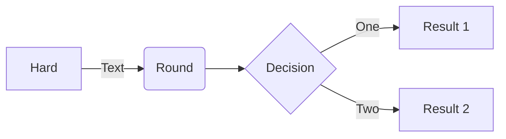
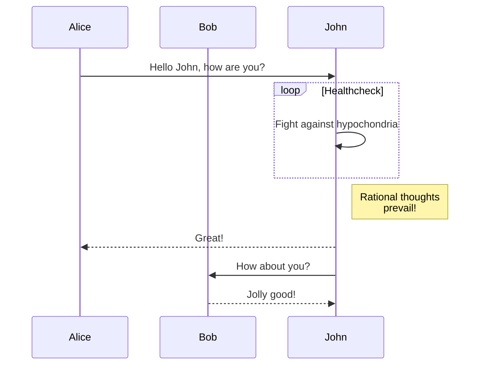

# Helix is Open AI in a box. Your box. Use chat or API. Deploy anywhere.
### Looking for a private GenAI platform? From language models to image models and more, Helix brings the best of open source AI to your business in an ergonomic, scalable way, while optimizing the tradeoff between GPU memory and latency.

\[
\begin{matrix}
\text{hola}  &2  &25 \\
1& 2&3 \\
\end{matrix}
\]

This $\sigma(z) = \frac{1}{1 + e^{-z}}$ is inline.

$$F(\omega) = \int_{-\infty}^{\infty} f(t) e^{-j\omega t} \, dt$$

$$
\begin{aligned}
  \nabla \cdot \mathbf{E} &= \frac{\rho}{\varepsilon_0} \\
  \nabla \cdot \mathbf{B} &= 0 \\
  \nabla \times \mathbf{E} &= -\frac{\partial \mathbf{B}}{\partial t} \\
  \nabla \times \mathbf{B} &= \mu_0 \left( \mathbf{J} + \varepsilon_0 \frac{\partial \mathbf{E}}{\partial t} \right)
\end{aligned}
$$

#### Open weights
Maintain full control over your data and models derived from it. Because we use open source models, you can own the weights, stay in control, and simplify data governance. Remove vendor lock-in and improve latency and security.

#### Human friendly
The natural chat interface to data prep and fine tuning workflows allows you to fine tune highly performant, optimized and small models that excel at specific tasks. This makes training your own AI accessible to everyone.

#### Developer & DevOps friendly
Helix is simple to integrate with: we have a simple API and you can also see what API calls to make from inside the chat app. Deploying the stack is easy with our optimized containers, deploy GPU runners with NVIDIA Docker or RunPod.

{{ partial "utils/icon.html" (dict "name" "github" "attributes" "height=24") }}
